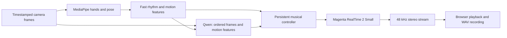

# Sway

**A generative theremin.**

Sway turns the rhythm and meaning of movement into a continuously unfolding piece of music.
Play an imaginary piano, suggest a strum, or draw a long phrase with your hands.
Frozen pretrained models supply tracking, interpretation, and generated audio; Sway connects them through persistent musical state.
No model training or fine-tuning is required.

**Status: local Apple Silicon prototype, with experimental motion interpretation.**
The instrument generates real streaming audio, accepts webcam motion, offers manual controls, and records stereo WAV files.
Gesture accuracy, musical coherence, and motion-to-audio alignment still need performer evaluation.
See the [validation notes](docs/prototype-validation.md) for measurements and limitations.
For the installed prototype on this Mac, follow the [first-play guide](docs/morning-test.md).

## Run it

Requirements: an Apple Silicon Mac, Python 3.12 through [uv](https://docs.astral.sh/uv/), Node.js/npm, and a recent Chrome browser.
Initial setup downloads roughly 1.6 GB of model assets plus runtime dependencies.
Allow at least 6 GB of free disk space and use headphones initially.
The development machine is an M2 Pro with 16 GB of unified memory.

```bash
git clone https://github.com/Audiofool934/sway.git
cd sway
uv sync --locked
uv run sway setup
uv run sway doctor
uv run sway serve
```

Open **http://127.0.0.1:8765**.
If the repository and assets are already installed, only `uv run sway serve` is needed.
Stop the server with Ctrl-C.

1. Choose an ensemble and press **Begin performance**.
2. Enable the camera and keep your hands visible.
3. Make repeated, deliberate finger taps to establish a pulse.
4. Hold a new action for several seconds so interpretation can settle.
5. Use **Record**, then **Finish take**, to save a stereo WAV.
6. Press **End performance** to stop both model workers.

For a controlled baseline, select **Choose a musical action** before starting.
This keeps rhythm tracking active while bypassing the vision-language model.
Turn off **Follow my pulse** to choose a manual tempo.
The ensemble and interpretation mode can change between performances; manual action and tempo can change while playing.
After hands disappear, music holds briefly and fades; returning hands restore it.
Turning the camera off returns to an unguided performance.

The server binds only to loopback.
Camera images remain in memory on this Mac and are never included in recordings.
Models and recordings live under `.cache/`, which Git ignores.
Each recording has a JSON sidecar with its ending control state and runtime counters.
Only one performance window can own the session; closing it stops the model workers.

## How it works



| Layer | Implementation | Purpose |
| --- | --- | --- |
| Tracking | MediaPipe Hand Landmarker and Pose Landmarker Lite in a browser worker | Timestamped hand and body landmarks |
| Rhythm | Finger strokes, wrist reversals, robust inter-onset intervals | Candidate accents, pulse estimate, movement energy |
| Semantics | Qwen3.5-0.8B, 4-bit MLX, frozen weights | Piano, strum, strike, sustain, still, or unknown; articulation |
| Musical state | Stable ensemble prompt, repeating four-chord framework, debounced interpretations | Style blending, sparse note anchors, continuity, tracking-loss fade |
| Generation | MRT2 Small exported MLX graph with persistent state | Generated arrangement in 40 ms stereo frames |
| Playback | AudioWorklet with bounded buffering and sample-rate conversion | Browser audio, gap counters, playback volume |

Rhythm reaches the controller directly.
Semantic inference uses three ordered camera images and measured motion features in a separate process.
Pauses between semantic tokens leave GPU scheduling opportunities for music.
The audio process requests macOS interactive scheduling before initializing its model runtime.
Its output is validated against a small schema; unknown or low-confidence actions preserve the current musical direction.
Two matching interpretations and visible tracked hands are required for a semantic change.
The model's confidence is self-reported, not statistically calibrated.

The controller supplies a sparse C / Am / F / G framework, changing chord every 16 beats.
The music model supplies the arrangement around it.
Finger accents map to chord tones, not to an inferred physical keyboard.
Style changes blend text embeddings without resetting the generator's audio state.
This is an inference-time system combining frozen models and control logic, not a newly trained end-to-end motion-to-music model.

## What to expect

- **Tempo control:** MRT2 receives scheduled note cues and style conditioning; this adapter has no direct BPM setter.
- **Slower semantic updates:** Interpretation takes several observations, inference, and debouncing.
- **Experimental tracking:** Camera angle, occlusion, subtle finger motion, subdivisions, and simultaneous hands can confuse onset detection.
- **Hand-led rhythm:** Pose landmarks are available and body movement is visible to the semantic model.
- **Composition planning:** Long-range form and intentional musical endings remain research work.
- **Shared GPU load:** Session details expose timing and playback gaps; manual interpretation provides a lighter baseline.
- **Buffering:** The browser starts with 320 ms of audio, in addition to model and tracking latency; actual motion-to-audio latency has not been measured.

The first design explored a 4B semantic model.
Combined testing showed substantial GPU contention, motivating the smaller default and cooperative scheduling.
The [original design](docs/first-prototype-design.md) records that exploration; this README describes the implementation.

## Render without a camera

```bash
uv run sway render --seconds 30 --palette chamber --action piano --tempo 108 --output outputs/first-take.wav
```

This runs the real music model and writes a WAV plus a timing report.
It refuses to overwrite an existing output.
This measures generation speed, not camera accuracy, audible latency, or musical quality.

## Development

```bash
uv run pytest -q
node --test tests/audio-buffer.test.js
uv run ruff check src tests
uv run ruff format --check src tests
```

Tests cover smooth finger-stroke timing, pulse estimation, tracking gaps, semantic debouncing, note conditioning, clip validation, local API boundaries, stereo resampling, buffering, and underrun recovery.
Model and browser checks are documented separately because they need downloaded assets and actual hardware.

| Path | Purpose |
| --- | --- |
| `src/sway/motion.py` | Causal rhythm extraction |
| `src/sway/semantics.py` | Frozen vision-language interpretation |
| `src/sway/controller.py` | Shared musical state |
| `src/sway/music.py` | MRT2 adapter and note planner |
| `src/sway/workers.py` | Model processes |
| `src/sway/session.py` | Lifecycle, streaming, recording |
| `src/sway/app.py` | Local HTTP and WebSocket interface |
| `web/` | Camera, playback, and performance UI |

Model revisions and asset URLs are pinned in `src/sway/config.py`.
Keep the locked MLX versions: the MRT2 export failed to import under MLX 0.32.2 and loaded successfully under 0.31.2.
`uv run sway setup --music-only` skips the optional semantic model.
`SWAY_DATA_DIR` can move model and recording storage to another disk; setup and serving must use the same value.

For heavier research on the configured development machine, check `colab usage`, then run `colab run --gpu T4 --timeout SECONDS path/to/script.py`.
One-shot jobs release their VM on completion; stop any persistent session with `colab stop -s NAME`.
The instrument does not depend on Colab.

## Models and attribution

- [Magenta RealTime 2](https://github.com/magenta/magenta-realtime): streaming music and MusicCoCa style resources.
- [Qwen3.5-0.8B via MLX Community](https://huggingface.co/mlx-community/Qwen3.5-0.8B-4bit): semantic interpretation.
- [MediaPipe](https://ai.google.dev/edge/mediapipe/solutions/vision/hand_landmarker/web_js): hand and body tracking.

See [THIRD_PARTY_NOTICES.md](THIRD_PARTY_NOTICES.md) for attribution and third-party licensing.
No license for original Sway code has been selected yet.
