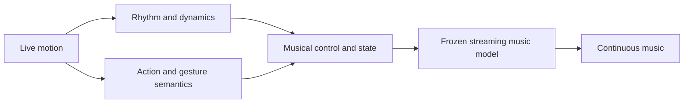

# Sway

**A generative theremin.**

Sway explores **training-free, real-time, motion-aware music generation**.
The goal is to turn the rhythm and meaning of human movement into a continuously unfolding piece of music.
The performer guides the music through motion, while pretrained models develop the arrangement.

> **Status:** Concept and architecture stage.
> This repository contains the initial project direction; a runnable prototype and performance measurements are still to come.

## The experience

Imagine strumming an invisible guitar.
Sway would interpret both the rhythm of your strumming and the musical character suggested by that action, then develop a piece around them.
Changing your movement could influence the instrumentation, rhythmic feel, intensity, and texture as the music continues.

Two kinds of information matter:

| Information in motion | Examples | Intended musical influence |
| --- | --- | --- |
| Rhythm and dynamics | Pulse, tempo, accents, pauses, repetition, movement intensity | Timing, groove, energy, and phrasing |
| Semantics | Drumming, strumming, bowing, and other expressive gestures | Instrumentation, articulation, texture, and musical direction |

These interpretations need to work together.
A fast movement could be a drum hit, a strum, or vibrato; its meaning determines how its timing should affect the music.
The aim is to preserve the performer's influence while giving the model room to develop a coherent composition.

## Proposed approach

The initial approach is training-free: reuse pretrained models with frozen weights and build the motion-to-music control at inference time.
No Sway-specific model training or fine-tuning is planned for the first prototype.

The proposed rhythm path uses tracking and signal processing to retain precise motion timing.
The semantic path interprets short sequences of movement with a pretrained video-language model.
Both update a shared musical state that steers an ongoing generation session.
Semantic updates can run less frequently than rhythmic analysis, allowing each path to operate at a suitable pace.

Real-time operation is a design goal: the system should respond to incoming motion using only the information observed so far and continue generating music as new input arrives.
End-to-end responsiveness and musical continuity need to be measured in the complete system.

The following are candidate building blocks, with integration still to be evaluated:

| Component | Candidate | Role |
| --- | --- | --- |
| Motion tracking | [MediaPipe Hand Landmarker](https://developers.google.com/edge/mediapipe/solutions/vision/hand_landmarker) and [Pose Landmarker](https://developers.google.com/edge/mediapipe/solutions/vision/pose_landmarker) | Extract hand and body landmarks from video. |
| Semantic interpretation | [Qwen3-VL](https://github.com/QwenLM/Qwen3-VL) | Interpret actions and movement context from video sequences. |
| Music generation | [Magenta RealTime 2](https://github.com/magenta/magenta-realtime) | Generate streaming music through existing style and note controls. |

Sway's central work is translating motion into effective musical control: combining rhythmic and semantic cues, handling transitions, and maintaining the context of the music already playing.

## First milestone

A webcam-driven prototype that generates an evolving piece of music while responding to both rhythmic and semantic changes in movement.

- [ ] Capture a timestamped stream of hand and body motion.
- [ ] Extract rhythmic cues and interpret a small set of musical actions.
- [ ] Connect both to a persistent music-generation session.
- [ ] Evaluate the experience with recorded motion sequences and live interaction.

Evaluation will focus on:

- **Responsiveness:** Delay and variation between an action and an audible change.
- **Rhythmic alignment:** Whether generated tempo and beat timing follow the intended motion cues.
- **Semantic response:** Whether changes in action produce appropriate musical changes.
- **Continuity:** Whether the music remains coherent through transitions, pauses, and tracking loss.
- **Performer control:** Whether a person can intentionally repeat and vary a musical idea.

Estimating a tempo from motion does not establish that a generator will follow it accurately.
Likewise, recognizing a gesture does not establish that the generated music will reflect its intended meaning.
These are central questions for the prototype.

The [MRT2 technical description](https://magenta.withgoogle.com/magenta-realtime-2) documents control latency and limits on direct drum-hit control that will inform the experiments.
The first milestone will establish which parts of the intended experience can be achieved with the available pretrained models and controls.
