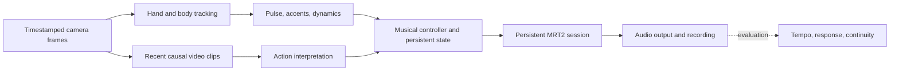

# Sway: first prototype design

**A generative theremin.**

Status: historical proposal, researched on 2026-09-26.
This document preserves the initial design, written before implementation and measurement.
The [project handoff](project-status.md) and [ensemble guide](gesture-ensemble.md) describe the paused implementation and supersede untested assumptions here.
The [first validation notes](prototype-validation.md) record the subsequent initial local experiment.

## Experience and product form

Sway should let a person shape a continuously unfolding instrumental piece through the rhythm and meaning of their movement.
The person supplies musical intent and phrasing; the system develops the arrangement around them.
The central product test is whether someone can hear their influence and intentionally repeat it.

Start with a **Mac desktop instrument using a camera and wired audio**.
Give it a focused performance view: tracking feedback, the current action interpretation, a pulse indicator, start/stop, and recording.
Keep camera calibration and technical diagnostics in a separate setup view.
A person should be able to listen and move without continually looking at the screen.

| Form                                | Role in Sway                                                                          | Decision                                                         |
| ----------------------------------- | ------------------------------------------------------------------------------------- | ---------------------------------------------------------------- |
| Mac app with an existing camera     | Establish the complete musical interaction on available hardware.                     | First playable product.                                          |
| USB sensor pod with a Mac companion | Give Sway a physical identity, fixed camera placement, and visible tracking feedback. | Develop after identifying a sensing limitation worth solving.    |
| DAW plugin                          | Fit Sway into a musician's recording and performance setup.                           | Follow the standalone experience.                                |
| Standalone hardware instrument      | Combine sensing, compute, controls, and audio output in one enclosure.                | Later, after measuring compute, thermal, and audio requirements. |

The first session could work like this:

1. Choose a musical palette and an initial harmonic setting.
2. Frame the upper body and both hands, then start the piece explicitly.
3. Establish a pulse with repeated movement.
4. Strum, strike, or sweep to influence the articulation and instrumentation while the piece develops.
5. Become still to let the phrase breathe, then resume without starting a new song.
6. End and save the performance with an explicit control.

Do not assign fixed roles such as left hand for tempo and right hand for meaning by default.
An action often involves both hands, and its timing and meaning should be interpreted together.
The first version should support a small, legible vocabulary before expanding into open-ended interpretation.

## Model selection

### Music engine

**Recommendation: begin with Magenta RealTime 2 Small and keep the Base model as a quality comparison.**

| Candidate                                                                               | Documented capabilities relevant to Sway                                                                                                    | Assessment                                                                                                                               |
| --------------------------------------------------------------------------------------- | ------------------------------------------------------------------------------------------------------------------------------------------- | ---------------------------------------------------------------------------------------------------------------------------------------- |
| [MRT2 Small, 230M](https://github.com/magenta/magenta-realtime)                         | Continuous generation and an Apple Silicon inference engine; the hardware table lists real-time support on M2 Pro.                          | Best initial integration candidate for the available machine.                                                                            |
| [MRT2 Base, 2.4B](https://github.com/magenta/magenta-realtime)                          | Larger model; the hardware table lists M2 Pro as insufficient for real-time streaming, with support on devices including M2 Max and M4 Pro. | Compare sound quality before deciding whether more compute is worthwhile.                                                                |
| [ACE-Step 1.5](https://github.com/ace-step/ACE-Step-1.5/blob/main/docs/en/INFERENCE.md) | Track generation and editing with parameters including BPM, key, and duration.                                                              | Useful future comparison for composition quality; its documented render interface does not establish continuous control during playback. |
| [Stable Audio Open Small](https://huggingface.co/stabilityai/stable-audio-open-small)   | Text-to-audio clips up to 11 seconds; the model card reports stronger results for sound effects than music.                                 | Possible source of short textures; a poor match for the central continuous-piece requirement.                                            |

These are suitability judgments from the documented interfaces, not listening-test results or an exhaustive leaderboard.
Generation faster than playback is only one requirement; new movement must also be able to affect upcoming audio without replacing the session.

MRT2 documents roughly 200 ms of control latency and 40 ms audio frames.
Those figures do not include Sway's complete camera-to-speaker path.
The authors also report that direct drum-hit control is impractical with the current response delay.
This makes phrase-level interaction more plausible than promising an immediate virtual drum kit. [Technical description](https://magenta.withgoogle.com/magenta-realtime-2)

### Motion and semantic perception

Use **MediaPipe Hand Landmarker plus Pose Landmarker** for timestamped hand and upper-body observations.
Pose provides body-relative context; hands provide finer articulation.
Use normalized, body-relative motion features before relying on monocular depth for absolute distance. [Hand tracking](https://developers.google.com/edge/mediapipe/solutions/vision/hand_landmarker), [pose tracking](https://developers.google.com/edge/mediapipe/solutions/vision/pose_landmarker)

Compare **Qwen3.5-4B** against **Qwen3-VL-4B-Instruct** on short, causal clips of the actual movements.
Both publish video-understanding support; neither model card establishes reliable recognition of Sway's air-playing gestures.
Qwen3.5 offers a non-thinking mode suitable for testing short structured responses. [Qwen3.5 model card](https://huggingface.co/Qwen/Qwen3.5-4B), [Qwen3-VL model card](https://huggingface.co/Qwen/Qwen3-VL-4B-Instruct)

Start with a quantized local runtime candidate through [MLX-VLM](https://github.com/Blaizzy/mlx-vlm), verifying video preprocessing and timestamp handling for the selected model.
Benchmark each candidate while the music engine is running.
Weights fitting in memory does not establish enough GPU time for uninterrupted music.
If a 4B model competes with generation, first reduce semantic invocation frequency and visual input size, then compare a smaller model against the same accuracy criteria.
Remote semantic inference can remain an option if acceptable to the performer; keep the rhythm and audio paths local.

MediaPipe's default gesture classifier recognizes poses such as an open palm or closed fist, rather than temporal actions such as strumming.
It is not a replacement for this semantic evaluation. [Gesture vocabulary](https://developers.google.com/edge/mediapipe/solutions/vision/gesture_recognizer)

## The musical controller

Sway needs an explicit musical controller between perception and generation.
This controller is the main project-specific work.
It can use rules, signal processing, and frozen models without training new weights.

### Fast timing, slower interpretation

The following rates are proposed operating points to benchmark, not achieved performance:

| Path          | Starting design                                                                               | Responsibility                                                                 |
| ------------- | --------------------------------------------------------------------------------------------- | ------------------------------------------------------------------------------ |
| Motion        | Process available camera frames, initially targeting 30 Hz and testing 60 Hz later.           | Track trajectories, movement extent, direction changes, and candidate accents. |
| Rhythm        | Update on each usable observation using actual timestamps.                                    | Estimate periodicity, beat phase, subdivision hypotheses, and confidence.      |
| Semantics     | Examine roughly 1-2 seconds of recent movement at about 0.5-1 updates per second.             | Select an action family or return unknown.                                     |
| Musical state | Update continuously; commit major changes at phrase boundaries when pulse confidence permits. | Preserve harmonic context and smooth changes in instrumentation and energy.    |
| Audio         | Run independently of semantic requests and UI work.                                           | Sustain generation, playback, and recording.                                   |

MediaPipe's asynchronous hand detector can ignore frames while busy, so processing cadence must be measured rather than inferred from camera FPS. [Live-stream behavior](https://developers.google.com/edge/mediapipe/solutions/vision/hand_landmarker/python)

Keep only the newest waiting semantic clip, discard stale responses, and never wait for a language model in the audio callback.
Continuous controls can use their latest value; timestamped accent events need a separate bounded queue so they are not accidentally overwritten.
Require repeated supporting evidence before switching action families.
Treat a model's self-reported confidence as a signal to evaluate, not a calibrated probability.

### Turning motion into usable controls

The inspected MRT2 engine exposes style blending, note onset/activity, guidance, and drumless controls.
It does not expose a direct BPM setter in that interface. [Engine interface at the inspected revision](https://github.com/magenta/magenta-realtime/blob/694a545e4ba0b88bf1150137b129582166d3e07f/core/include/magentart/mlx_engine.h)

| Intended influence            | Proposed mechanism                                                                                                                               | What remains to prove                                                                       |
| ----------------------------- | ------------------------------------------------------------------------------------------------------------------------------------------------ | ------------------------------------------------------------------------------------------- |
| Tempo and pulse               | Estimate a beat grid and schedule sparse pitched anchors through note-onset control; include tempo language in style prompts as a secondary cue. | Whether the audible arrangement follows tempo and phase, including generated percussion.    |
| Strumming                     | Identify the action family, derive rhythmic events from the trajectory, and favor plucked/strummed style anchors.                                | Whether instrumentation changes clearly while harmonic identity survives.                   |
| Striking                      | Derive accents and favor percussive musical character.                                                                                           | Whether it feels responsive despite the limits on individual generated drum hits.           |
| Sustained sweeping or bowing  | Favor sustained articulation and smoother phrasing, with fewer onset events.                                                                     | Whether the result is repeatable and distinguishable from strumming.                        |
| Movement extent and intensity | Smoothly vary a small set of style weights and phrase-density targets.                                                                           | Whether musical energy changes predictably; intensity is not automatically BPM or loudness. |

Use explicit note onsets for the pulse-control experiment, and compare against the model choosing its own onsets.
Style changes should blend within a compatible musical palette, rather than rewriting an unrestricted prompt on every camera frame.

For a stable repeated pulse, the controller can predict a future beat and submit a cue early using measured audio delay.
Prediction cannot remove delay from an unexpected gesture.
At 120 BPM, 200 ms is 40% of a beat, so this distinction will be audible.

If generated rhythm will not follow reliably, evaluate a separate local percussion layer with the model set to drumless.
That could establish a precise performed pulse, but synchronizing the generated accompaniment would remain a separate problem.
Keep it as an explicit alternative to test, not an assumed solution or a substitute for the continuously generated piece.

### A piece needs persistent musical identity

MRT2's model card describes an effective receptive field of about 20 seconds.
Continuous generation therefore does not establish long-form motif recall or a multi-minute compositional plan. [Model card](https://github.com/magenta/magenta-realtime/blob/694a545e4ba0b88bf1150137b129582166d3e07f/MODEL.md)

Maintain a compact state containing the palette, harmonic setting, pulse estimate, current action, phrase position, energy trajectory, and recent motif or chord cues.
Begin with a restrained harmonic plan and sparse anchors, leaving room for the generator to develop the arrangement.
Evaluate whether reintroducing earlier cues creates audible recurrence.
This state guides composition; it does not guarantee that every instrument follows a symbolic score.

Stillness should hold the established context and allow a phrase to settle.
Brief tracking loss should suspend new controls while preserving the session.
For a first experiment, hold for two seconds of tracking loss and then fade if tracking remains absent.
An explicit stop control should always work immediately through the output path.

## Hardware and software shape

The inspected development machine is an **M2 Pro MacBook Pro with 16 GB unified memory**.
That is a reasonable starting point for MRT2 Small according to the published table, but the combined sensing, semantics, and audio workload is unmeasured.

| Component         | First prototype                                                                   | Upgrade condition                                                                                                                               |
| ----------------- | --------------------------------------------------------------------------------- | ----------------------------------------------------------------------------------------------------------------------------------------------- |
| Compute           | Existing Mac, MRT2 Small, one semantic model at a time.                           | Upgrade after a listening comparison demonstrates a worthwhile benefit from Base and concurrent-load testing establishes the required headroom. |
| Camera            | Existing RGB camera, positioned to see both hands and upper body in steady light. | Try a wired 60 FPS camera if measured timing or motion blur limits the interaction.                                                             |
| Hand sensor       | Camera-based tracking.                                                            | Trial an Ultraleap sensor if finger detail, depth, or occlusion is the measured problem.                                                        |
| Audio             | Wired headphones or speakers; use the existing audio output first.                | Add an interface for routing, connections, or measured audio-buffer problems.                                                                   |
| Physical controls | Explicit start/stop and recording controls in the app.                            | Add a footswitch if hands-free transport helps performance.                                                                                     |

A 30 FPS camera has a 33.3 ms frame interval; 60 FPS reduces this to 16.7 ms.
That helps sensing but cannot eliminate the music engine's response delay.

Ultraleap provides stereo IR hand sensing, and its Hyperion documentation lists macOS support.
It is a specialized vision sensor, not a complete interpreter of musical actions.
Confirm current availability and operation on the target macOS version before choosing it for the product. [Hyperion documentation](https://docs.ultraleap.com/hand-tracking/Hyperion/index.html), [desktop setup](https://docs.ultraleap.com/hand-tracking/desktop-setup.html)

The most useful initial physical concept is a **small USB camera pod on an adjustable stand**, with clear tracking feedback and the Mac handling generation.
Test the camera angle and comfortable playing volume before fixing the enclosure geometry.
Wearables and all-in-one compute would introduce different interaction and integration requirements; they can be evaluated once the basic musical experience works.

For software, reuse MRT2's C++/MLX engine for audio and put the initial perception/controller experiments in a separate Python process.
Exchange timestamped controls over local IPC, keeping musical events independent of the UI.
This is an implementation proposal, not a scaffold that already exists.
The upstream engine already provides an audio runner, state handling, and metrics to build on. [Developer guide](https://github.com/magenta/magenta-realtime/blob/main/docs/apps/developer.md), [audio runner](https://github.com/magenta/magenta-realtime/blob/694a545e4ba0b88bf1150137b129582166d3e07f/core/include/magentart/realtime_runner.h)

## Experiments that decide the design

Run the tests in this order so sensing errors are distinguishable from generator limitations.
The numerical criteria below are proposed prototype gates, not measured results or general musical-perception standards.

1. **Generator control without a camera.**
   Feed timestamped note patterns and style changes into a persistent MRT2 Small session.
   Measure response delay and variation, rendered tempo, beat phase, and continuity across several seeds.
   For the first tempo gate, test 90, 120, and 150 BPM, aiming to settle within 5 BPM of the target within eight beats.
   Report phase error separately, since matching BPM alone does not establish synchrony.

2. **Motion interpretation on a small recorded set.**
   Include strumming, striking, sustained sweeping, stillness, unrelated movement, and temporary occlusion from several performers.
   Compare the two semantic candidates, retaining unknown as a valid answer.
   Measure per-action errors, false switches, and action-change delay.
   Aim for a stable semantic update within two seconds, including the observation window.
   Any calibration examples and evaluation examples should be separate.

3. **Complete system under concurrent load.**
   Run tracking, semantic interpretation, and music together for 20 minutes on the M2 Pro.
   Measure audio underruns, frame processing time, dropped observations, memory pressure, and camera-to-audible response.
   The initial continuity gate is zero audio underruns after warm-up.
   Compare the full system with semantics disabled to expose resource contention.

4. **An intentional musical performance.**
   Perform a three-minute piece with a recurring idea, one tempo change, two action-family changes, stillness, and a deliberate ending.
   Test the same action at different tempos and different actions at the same tempo.
   Ask listeners to identify intended changes without seeing the performer, and ask the performer to repeat a musical effect.
   Judge whether it sounds like one developing piece and whether the person feels agency over it.

Failure of the tempo or semantic tests would leave an essential part of Sway's intended experience unresolved.
Use the results to change the control design or model choice before investing in custom hardware.

## Working decisions

- Preserve training-free operation: frozen model weights, no Sway-specific fine-tuning, and explicit inference-time control.
- Prioritize a complete instrumental piece with motion-derived rhythm and semantics.
- Start with a local Mac instrument and existing sensing hardware.
- Choose MRT2 Small as the first engine candidate; compare Base before buying compute.
- Select the semantic model through gesture-specific and concurrent-load evaluation.
- Keep native frame timing, musical response delay, and long-form continuity as separate measurements.

Open decisions are the compute-location preference, the first musical palette, and how much exact beat control the intended experience requires.
