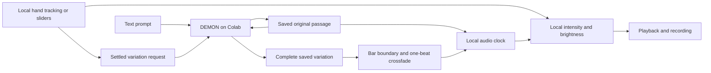

# Sway Flow

Date: 2026-09-27.
Status: retained experiment, further product development deferred.
The project is paused, with [Gesture ensemble](gesture-ensemble.md) as the chosen direction on return; see [project status](project-status.md).
Flow keeps a saved musical passage on a local audio timeline, with generation happening separately on Colab.
It is the first implementation of the [music flow direction](product-direction-2026-09-27.md).

## Play

Run `uv run sway serve` and open <http://127.0.0.1:8765/flow.html>.
The included “Room to breathe” sketch is an original, locally composed eight-bar passage at 96 BPM in A minor.
Its prepared variation adds melodic movement while retaining the same accompaniment and timeline.
These are testable musical materials, not neural generation demos.

1. Press **Begin flow**.
2. Move **Explore the variation** between the stored original and a variation.
3. Move **Intensity & brightness** for smooth local dynamics and timbre changes.
4. Use **Return to original** to restore the original source at the current intensity, without resetting the timeline.
5. Use **Finish the phrase** to begin a one-bar fade at the next bar boundary, or **Stop flow** for a short immediate fade.

The camera is optional.
Enable it and show either hand in a comfortable position; control starts automatically.
Each hand picks up the current musical value from the position where it appears.
Your right-hand height controls intensity and brightness, while moving your left hand toward your right explores more variation.
The camera labels each hand's role, and the indicators beside the sliders show whether that hand is active or out of view.
Use **Swap hands** if the inferred hand labels do not match your setup.
The optional **Reset comfortable pose** button makes the current pose the original at 60% intensity.
Missing hands and camera shutdown hold the last controls and leave playback running.
After a hand has been out of view for more than 350 ms, its return establishes a fresh position without jumping the sound.
Dragging a slider temporarily takes over that one control; the other hand stays active, and releasing the slider hands control back automatically.
Returning to the original sets the variation to zero and lets the left hand pick up from its current position, while the right hand stays active.

## Generate on Colab

Use the existing authenticated Colab CLI and the bounded live runner:

```bash
colab usage
uv run python scripts/run_colab_live.py --model demon --gpu A100 --minutes 20 --setup-timeout 1800 --port 8767
```

The runner prepares the pinned DEMON runtime, opens a private SSH connection, writes a separate private Flow connection file, and releases its GPU at the deadline or on interruption.
The Flow page refreshes availability automatically.
Follow the [standing compute policy](cloud-setup.md#compute-policy) when conducting repeated experiments.

With Colab ready, open **Describe a new piece**, enter a prompt and requested tempo, and generate a four- or eight-bar starting passage.
Audition it before performing.
Requested tempo and key are conditioning, not verified musical properties of the result.
The included sketch supplies an exact grid for testing; generated music may disagree with its requested grid.

Describe a transformation in **Where it could go** and press **Prepare a live variation**.
The adapter keeps the original source fixed, reuses its latent representation on the GPU, and renders a bounded transformation from that source.
An authenticated hash handshake avoids re-uploading a source already held by the service, including a starting piece just generated there.
The complete variation is downloaded before it can replace the currently playing variation.
It enters on the next bar of the selected grid and crossfades over one beat, while the original timeline keeps moving.

With **Let my movement evolve the variation** enabled, settled movement along the variation control also changes the generation strength.
The controller groups the control into five levels, waits for 800 ms of stability, permits at most one new request every four seconds, and allows only one request in flight.
Previously generated settings reuse saved audio instead of consuming more GPU compute.
Changes in intensity remain entirely local.
A failed cloud request disables automatic evolution and preserves the current passage; re-enable it after restoring the connection.

This first adapter prepares whole-passage transformations on demand.
It does not send every camera frame to the generator or require arriving network audio to sustain playback.
Camera frames stay on this Mac, and Flow does not currently call Qwen.
Gesture ensemble uses Qwen interpretation through its separate performance page.

## Record and return

**Record** captures stereo WAV audio after expression controls and before the listening-volume slider.
**Finish take** or ending the flow produces downloads for the audio and a JSON control trace.
Recording stops automatically after ten minutes to bound browser memory.
Control events include the audio-clock frame at which their targets were accepted, and the trace stores the source, initial state, and applied variation identifiers.
Keep the audio take for exact replay; the control trace is a foundation for later editing, not a MIDI score or a complete session importer.

Sources and variations are retained under `.cache/flow/` with their prompt, seed, requested grid, timing, and provenance.
The browser reuses those files after the GPU session ends.
Returning to the original bypasses generative reconstruction; intensity and brightness still apply to the stored source.

## Implementation and limits

The AudioWorklet owns playback position, bar boundaries, smoothing, variation swaps, and ending fades.
The local server stores passages and forwards validated text and source audio through an authenticated, loopback-only connection.
DEMON stays loaded on Colab during the runner's bounded window.
The source is never replaced by its own transformation, which prevents cumulative generative drift.



Generated passages are level-matched with a peak cap and a five-millisecond taper at the loop boundary.
That reduces clipping and boundary clicks but does not guarantee matching phrases, downbeats, motif retention, or a satisfying loop.
Generated material still needs performer listening evaluation, and a manual beat-grid editor remains future work.
Current controls do not promise isolated stems, precise arrangement density, editable MIDI, or exact note control.
The performance details distinguish engine time, full request/transfer time, audio-thread acknowledgement, and the browser's output-latency estimate.
None alone establishes physical gesture-to-speaker latency.

The Colab adapter imports upstream DEMON at revision `229af3d3d68e7e40764c93259e88149ef6546077` using its documented Session interface.
DEMON's combined distribution declares AGPL-3.0-or-later; its upstream attribution and product-integration considerations are recorded in the [direction document](product-direction-2026-09-27.md#what-to-take-from-demon).
