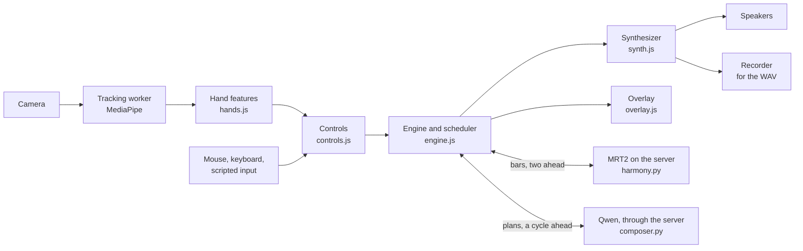

# How Sway works

A manual for Sway: the music and audio ideas it is built on, and every part of the instrument.

It assumes no background in music theory or production.
Part 1 explains the foundations: sound, notes, scales, chords, rhythm, synthesizers, samples, MIDI, and digital audio.
Part 2 walks through Sway part by part, linking each idea from Part 1 to the code that uses it.
Part 3 follows one note from your hand to the speakers.
Part 4 is a glossary, and Part 5 points to good places to learn more.

This manual describes the V1 implementation in this checkout, including the expressive lead and optional listening mixer.
Dated measurements come from the development Mac, an M2 Pro, in Chrome; they are observations of that setup, not guarantees for other cameras or computers.
The [V1 plan](v1-plan.md) records why each choice was made and how it was measured.

- [Part 1: Foundations](#part-1-foundations)
- [Part 2: Sway, part by part](#part-2-sway-part-by-part)
- [Part 3: One note, from hand to speaker](#part-3-one-note-from-hand-to-speaker)
- [Part 4: Glossary](#part-4-glossary)
- [Part 5: Learning more](#part-5-learning-more)

## Part 1: Foundations

### 1.1 Sound

Sound is a vibration in the air.
A speaker cone moves back and forth, pushing and pulling the air, and your ear hears the changes in pressure.
A sound has three basic properties:

- **Frequency** is how many times per second the vibration repeats, measured in hertz (Hz).
  You hear it as pitch: faster is higher.
  The note A above middle C vibrates 440 times a second, at 440 Hz.
  People hear roughly from 20 Hz to 20,000 Hz.
- **Amplitude** is how large the vibration is, and you hear it as loudness.
  It is measured in decibels (dB), a logarithmic scale: 6 dB more is about twice the amplitude, and 10 dB more sounds roughly twice as loud.
- **Timbre**, or tone color, is what makes a piano and a violin sound different on the same note.

Timbre comes from **harmonics**.
A musical note is not one frequency but a stack of them: the **fundamental**, which sets the pitch, and **overtones** at whole-number multiples of it.
A note at 110 Hz also contains 220, 330, 440, and 550 Hz and more, each at its own strength.
A flute has few, weak overtones and sounds pure; a trumpet or a buzzing synthesizer has many strong ones and sounds bright.

How a sound changes over time matters as much as its harmonics.
A plucked string starts suddenly and fades, while a bowed violin can swell and hold.
The shape of a note's loudness over time is its **envelope** (see 1.8).

### 1.2 Notes and pitch

Doubling a frequency raises the pitch by an **octave**, and notes an octave apart sound like the same note, higher or lower.
110, 220, 440, and 880 Hz are all the note A.

Western music divides each octave into 12 equal steps called **semitones**.
Each semitone multiplies the frequency by about 1.0595, the twelfth root of 2, so twelve of them make exactly one doubling.
This tuning is called equal temperament.
A semitone divides further into 100 **cents**, a unit for small differences such as a slightly out-of-tune note or the width of a vibrato.

The twelve notes are named with letters, and with sharps (♯, a semitone up) or flats (♭, a semitone down): C, C♯, D, D♯, E, F, F♯, G, G♯, A, A♯, B, and then C again.
On a piano, the white keys are the plain letters and the black keys are the sharps and flats.
A number after the name gives the octave: C4 is middle C, A4 is 440 Hz, and A3 is 220 Hz.

Software usually names notes by number.
The MIDI standard (see 1.10) numbers every semitone from 0 to 127: middle C is 60, A4 is 69, and each step up is one semitone.
Note number _n_ has a frequency of 440 × 2^((_n_ − 69) / 12) Hz, and Sway's `frequency()` function in [theory.js](../web/instrument/theory.js) is exactly that formula.

| Note         | MIDI number | Frequency | In Sway                               |
| ------------ | ----------- | --------- | ------------------------------------- |
| A1           | 33          | 55 Hz     | The bass's A                          |
| A2           | 45          | 110 Hz    | The lowest note of the answering line |
| A3           | 57          | 220 Hz    | The ladder's lowest rung              |
| C4, middle C | 60          | 262 Hz    |                                       |
| A4           | 69          | 440 Hz    | The tuning reference                  |
| G5           | 79          | 784 Hz    | The ladder's highest rung             |

A **pitch class** is a note name without its octave: every C, from the lowest to the highest, has the pitch class C.
Many of Sway's checks work on pitch classes, such as whether a note belongs to the chord now playing.

### 1.3 Scales and keys

A **scale** is a chosen set of notes to make music from.
A **key** is a scale with a home note, the **tonic**, where the music sounds at rest.

The two most common kinds of key are major, which sounds bright, and minor, which sounds darker or more wistful.
**A minor** uses only the piano's white keys, starting from A: A, B, C, D, E, F, G.
C major uses the same seven notes with C as home; keys that share their notes like this are called relative keys.

A **pentatonic** scale keeps five of a key's seven notes, leaving out the two that clash most easily.
A minor pentatonic is A, C, D, E, G, leaving out B and F.
Any of its notes sounds acceptable over the common chords of the key, which is why so many guitar solos and improvisations use it.

**Sway's ladder** is two octaves of A minor pentatonic: ten rungs from A3 to G5, which are A3, C4, D4, E4, G4, A4, C5, D5, E5, and G5 (MIDI 57, 60, 62, 64, 67, 69, 72, 74, 76, and 79).
Every rung is in the scale, so the lead can never play a wrong note; this is V1's rule that nothing sounds wrong.

### 1.4 Chords and harmony

A **chord** is several notes sounding together.
The basic chord, a **triad**, stacks three notes: the **root**, which names the chord, a **third** above it, and a **fifth**.
A minor is A, C, and E.
In a minor chord the third is three semitones above the root, as A to C; in a major chord it is four, as C to E in C major.
That one semitone is most of the difference between their moods.

The key of A minor provides these chords, each built on one of its notes.
Musicians number chords by their root's place in the scale, in Roman numerals, lowercase for minor:

| Chord | Notes | Numeral | Character, roughly                  |
| ----- | ----- | ------- | ----------------------------------- |
| Am    | A C E | i       | Home                                |
| C     | C E G | III     | Bright, close to home               |
| Dm    | D F A | iv      | Soft and darker, a step away        |
| Em    | E G B | v       | Unsettled, leaning back toward home |
| F     | F A C | VI      | Warm, lifting away from home        |
| G     | G B D | VII     | Bright and open, leading onward     |

**Harmony** is the sequence of chords under the melody, and a **progression** is a sequence of chords that repeats.
Sway's built-in band plays one chord per bar, four bars per cycle:

- From Air to Groove it plays **Am F C G**: home, away, and back, a progression found in countless songs.
- At Drive and Peak it plays **F G Am C**, which starts away from home and climbs, so it feels more driven.

A melody note that belongs to the current chord, a **chord tone**, sounds settled, and other notes add a gentle tension that wants to move.
Sway's ladder brightens the rows that are chord tones of the chord now playing, so you can choose settled or tense notes.

A **voicing** is how a chord is actually played: which notes, in which octaves.
Sway writes its voicings so that each chord keeps notes in common with the next and the harmony moves smoothly instead of jumping, which is called **voice leading**.

| Chord | Bass note | Pad voicing | Notes                      |
| ----- | --------- | ----------- | -------------------------- |
| Am    | A1        | A3 C4 E4 G4 | Adds G, making Am7         |
| F     | F2        | F3 A3 C4 E4 | Adds E, making Fmaj7       |
| C     | C2        | G3 C4 E4 G4 |                            |
| G     | G2        | G3 D4 E4 A4 | Leaves out B; adds E and A |
| Dm    | D2        | D3 A3 C4 E4 | Leaves out F               |
| Em    | E2        | E3 G3 D4 G4 | Leaves out B               |

Two notes a semitone apart, such as B and C or E and F, rub against each other: a **dissonance**.
The ladder has C and E, so Sway's G and Em leave out B, and its Dm leaves out F; the voicings stay full without them.

### 1.5 Rhythm and time

The **beat** is the pulse you would tap your foot to, and the **tempo** is how many beats there are per minute (**BPM**).
Sway's world, Night Drive, runs at 100 BPM, so a beat lasts 0.6 seconds.

Beats are grouped into **bars**, also called measures.
Most popular music is in 4/4 time: four beats per bar, of which the first, the **downbeat**, is the strongest.
At 100 BPM a bar lasts 2.4 seconds.

Beats divide into smaller notes: two **eighth notes** or four **sixteenth notes** per beat, so a bar of 4/4 has sixteen sixteenths.
At 100 BPM a sixteenth lasts 150 milliseconds.
Counting a bar in sixteenths sounds like "one e and a, two e and a, three e and a, four e and a", where the "and" is the second eighth note of the beat.

Bars group into **phrases**, like sentences.
Sway's phrase is the **cycle** of four bars, 16 beats or 9.6 seconds: the chord progression repeats each cycle, a loop captures one cycle, and Qwen composes one cycle at a time.

Music software lays time out on a **grid** of subdivisions, and **quantizing** moves notes onto the grid.
Sway quantizes as you play: its timing help setting snaps your notes to sixteenths (Tight), to eighths (Loose), or not at all (Off).

**Swing** delays every second subdivision, so the rhythm lilts instead of marching.
It is measured by where the off-beat note falls within its pair: at 50% the two halves are equal, or straight, and near 67% the rhythm becomes a triplet shuffle.
Sway swings its sixteenths at 56%, a light swing common in hip-hop and downtempo grooves.

A **backbeat** is a snare or clap on beats 2 and 4, the backbone of most pop, rock, hip-hop, and electronic music.
A **fill** is a short drum figure at the end of a phrase that leads into the next.

### 1.6 Dynamics and articulation

**Dynamics** are changes in loudness across a performance: a soft verse, a loud chorus, a crescendo that grows.
On real instruments, playing harder usually makes a note both louder and brighter, because a harder strike excites more overtones.

**Velocity** is how hard a note is struck, the number that keyboards, MIDI, and synthesizers use for dynamics: 1 to 127 in MIDI, and 0 to 1 in Sway.
A quicker pinch gives Sway's lead a higher velocity, making the note louder and brighter.
The response adapts to your recent pinches, so a usual strike settles around 0.72, with a range from 0.3 to 1.
Mouse clicks, which have no measured pinch speed, use the usual velocity.
Leaning toward the camera while holding a note creates a **swell**, raising its level and opening its filter; leaning away softens it.

**Articulation** is how notes begin and connect.
**Legato** notes flow into one another without a new attack, as when a singer slides between notes or a violinist changes notes within one bow stroke.
In Sway, moving your hand to another rung while still pinching plays legato: the note glides to the new pitch without a new attack.
Pinching again starts a new, separately articulated note.

**Vibrato** is a small, regular wobble in pitch that singers and string players use to warm a held note.
Sway's lead adds one automatically once a note has held for a moment.

### 1.7 The band: roles in an arrangement

An **arrangement** decides which instruments play what, and when.
Most bands divide the work into roles:

- **Drums** keep time and carry the energy.
  - The **kick** drum is the low thump that marks the strong beats.
  - The **snare**, or a **clap**, is the crack of the backbeat on 2 and 4.
  - **Hi-hats** tick out the subdivisions; a closed hat is short, and an open hat rings and sizzles.
  - A **shaker** adds soft, steady subdivisions.
  - A **crash** cymbal marks the start of something new.
  - A **riser**, a sweep of noise that climbs in pitch and loudness, builds anticipation before a change.
- **Bass** plays the lowest line, usually the root of each chord, locking in with the kick drum.
  An **approach note** at the end of a bar leads into the next chord's root.
- **Harmony** instruments play the chords.
  A **pad** holds them as a soft, sustained bed of sound, and a keyboard **comps** by striking the chord in a rhythm.
- An **arpeggio** plays a chord one note at a time, in a repeating pattern.
- The **lead** plays the melody, the part people hum; in Sway, that is you.
- A **counter-melody** answers or weaves around the lead, as in **call and response**.
  Sway's answering line, written by Qwen, plays this role.

**Energy** comes from density: more instruments, more notes, and brighter sounds.
Music builds by adding parts, drops to a **break** (Sway's **cut**), and returns with a crash.
Longer pieces have **sections** such as an intro, verses, choruses, a bridge, and an outro; V1 has repeating cycles whose energy you shape yourself.
Most pieces **end** by returning to the tonic chord, home, often held while it rings out.

### 1.8 Synthesizers

A **synthesizer** makes sound from electronic building blocks instead of recording it.
Sway synthesizes almost everything it plays, in the browser.

**Oscillators** produce a repeating wave at a pitch.
The wave's shape decides its harmonics, and so its basic timbre:

| Wave     | Harmonics                  | Sounds                                       | In Sway                                         |
| -------- | -------------------------- | -------------------------------------------- | ----------------------------------------------- |
| Sine     | None, only the fundamental | Pure and soft                                | The kick, the bass's sub, the lead's low octave |
| Sawtooth | Every harmonic             | Bright and buzzy, like strings or brass      | The lead, the pad, the bass's body              |
| Square   | Odd harmonics              | Hollow, like a clarinet or an old video game | The arpeggio                                    |
| Triangle | Odd harmonics, faint       | Soft and rounded                             | The snare's tone, the loop pluck                |
| Noise    | Every frequency, at random | Hiss                                         | Drums and cymbals                               |

Two oscillators slightly out of tune with each other, **detuned**, beat against each other and sound thicker, like several players.
Sway's pad and lead are built this way.

A **filter** removes some frequencies.
A **lowpass** filter lets low frequencies through and cuts those above its **cutoff**, making a sound darker; a **highpass** filter does the opposite, and a **bandpass** filter keeps only a band in between.
**Resonance**, written Q, emphasizes the frequencies near the cutoff and adds a vocal edge.
Starting from a bright oscillator and filtering it down is called **subtractive synthesis**, and most of Sway's voices work this way.

An **envelope** shapes a sound over time, usually in four stages called **ADSR**:

- **Attack:** how quickly the note reaches full level.
- **Decay:** how quickly it falls back after the attack.
- **Sustain:** the level it holds while the note is held.
- **Release:** how quickly it fades after the note ends.

A pluck has a fast attack, a short decay, and no sustain; a pad has a slow attack and a long release.

A **low-frequency oscillator** (LFO) is a slow wobble applied to something else; applied to pitch, it makes vibrato.

**FM synthesis**, frequency modulation, makes one oscillator wobble another's pitch so fast that the wobble becomes new harmonics.
It produces bell-like and electric-piano tones; Yamaha's DX7 made it famous in 1983, and Sway's keys use it.

**Effects** process the finished sound:

- **Reverb** imitates a room: the tail of reflections after a sound.
- **Delay** repeats the sound like an echo; Sway's repeats every dotted eighth note, three quarters of a beat.
- **Saturation** gently distorts a sound, adding harmonics and warmth.
- **Panning** places a sound between the left and right speakers.
- A **compressor** turns down the loudest moments so the level is more even, and a **limiter** is a strict ceiling.
- **Ducking**, also called sidechain compression, briefly lowers one part whenever another hits.
  In Sway, the harmony, bass, keys, and arpeggio dip under every kick, the pumping feel of much electronic music.

Browsers include a construction kit for all of this, the **Web Audio API**.
An **AudioContext** holds a graph of nodes, such as oscillators, filters, gains, a convolver for reverb, delays, compressors, and panners, connected like the cables of a modular synthesizer.
Every parameter can be scheduled at an exact time on the context's clock, which is what lets Sway place notes precisely (see 2.6).

### 1.9 Three ways to make a sound

An instrument's sound can be made in three ways, and Sway's design depends on the difference:

- **Synthesis** computes the sound from a recipe of oscillators, filters, and envelopes.
  It is instant and small and can respond to any control, but realistic acoustic instruments are hard to synthesize.
- **Samples** are recordings of real instruments, played back by a **sampler**.
  Good libraries record every few notes at several **velocity layers**, soft to hard, with repeated takes so that repeated notes differ, and with loop points so held notes can sustain.
  Samples sound real and start almost as fast as synthesis, but they are large downloads, and an instrument can only do what was recorded.
  V1 uses no sampled instrument libraries.
- **Generation** uses a trained model.
  An audio model such as MRT2 produces the waveform itself and can make sounds that no recipe or library has; a language model such as Qwen writes musical decisions, such as chords, as text.
  Generation takes time and computing power and can drift from what was asked, so it cannot sit between a gesture and its sound.

What makes each sound in V1:

| Part                                     | How it sounds                                                                        | What decides its notes                                             |
| ---------------------------------------- | ------------------------------------------------------------------------------------ | ------------------------------------------------------------------ |
| Lead                                     | Synthesized in the page                                                              | Your hand: height, pinch, and timing                               |
| Loops                                    | Synthesized plucks                                                                   | Phrases you played and captured                                    |
| Drums                                    | Synthesized                                                                          | Fixed patterns for each energy level                               |
| Bass                                     | Synthesized                                                                          | Fixed patterns on each chord's root                                |
| Keys and arpeggio                        | Synthesized                                                                          | Fixed patterns on each chord                                       |
| Pad                                      | Synthesized; it plays when harmony is set to synthesized, or when MRT2's bar is late | Each bar's chord                                                   |
| Generated harmony                        | **Generated by MRT2**                                                                | The chords, and when Qwen composes, its texture and answering line |
| Chords, texture, answering line, caption | **Written by Qwen**, or the built-in progression when Qwen is off or late            | Composed four bars at a time                                       |

### 1.10 MIDI

**MIDI**, the Musical Instrument Digital Interface, dates from 1983.
It is a language for musical events, not a sound: a MIDI message says "note 60 on, velocity 100" and later "note 60 off", and the synthesizer or sampler that receives it decides what that sounds like.
The same MIDI performance can be played by a piano, a string section, or a drum machine.

The main messages:

- **Note On** and **Note Off**, each with a note number (0 to 127) and a velocity (0 to 127).
- **Control Change** (CC), which moves a controller, for example CC 1 modulation, CC 7 volume, CC 10 pan, CC 11 expression, and CC 64 the sustain pedal.
- **Pitch Bend**, which slides the pitch smoothly.
- **Program Change**, which selects an instrument.

One connection carries 16 **channels**, so it can address 16 instruments at once.

**General MIDI** standardizes instrument numbers and a drum map, so a file sounds similar on any device.
Drums go on channel 10, where each note number is a drum: 36 is the kick, 38 the snare, 39 a hand clap, 42 a closed hi-hat, 46 an open hi-hat, 49 a crash cymbal, and 70 maracas, which Sway uses for its shaker.

A **MIDI file** (.mid, a Standard MIDI File) stores tracks of time-stamped events.
Time is counted in ticks per quarter note, and Sway uses 480.
A tempo event gives the length of a quarter note in microseconds: 600,000 at 100 BPM.

Sway exports each piece as a MIDI file with a track per part: Lead on channel 1, Loops 2, Keys 3, Pad 4, Bass 5, Arp 6, Answer 7, and Drums 10.
Note positions include the swing, as you heard it.
MRT2's audio cannot be written as MIDI, but the Pad track holds every chord that MRT2 played over.
Opening the file in a digital audio workstation lets you give every part another instrument, edit notes, or rearrange the piece.

### 1.11 Digital audio

A computer stores sound as **samples**: measurements of the waveform taken many times a second.
The word also means a recorded instrument sound, as in 1.9; context makes the meaning clear.

- The **sample rate** is how many measurements are taken per second: 44,100 for CDs, and 48,000 for video and most audio hardware.
  A sample rate can represent frequencies up to half its value, the Nyquist limit, so both cover the range of hearing.
  MRT2 renders at 48 kHz, and Sway's WAV export uses the audio device's rate, usually 48 kHz.
- The **bit depth** is each measurement's precision: 16 bits for CDs and Sway's WAV exports, and 24 in studios.
- **Channels:** one for mono, two for stereo.
- **PCM** is the plain list of measurements, and a **WAV** file is PCM with a short header.

Digital levels are measured in **dBFS**, decibels below full scale.
0 dBFS is the largest value the format can hold, and anything louder is cut off flat, **clipping**, which sounds harsh.
The **peak** level is the highest instant, and **RMS** is the average energy, closer to perceived loudness.
**Headroom** is the space between the peaks and 0 dBFS.
Sway's master chain keeps peaks below full scale with a compressor, a limiter, and a safety clipper, and its exports have peaked between -1.6 and -2.0 dBFS without clipping.

**Latency** is the delay between an action and its sound.
Audio systems buffer sound in small blocks, which adds delay; Sway measured 37 ms of output latency on the development Mac.
A camera adds more: capturing a frame and finding the hands took a median of 50 ms.
Players feel delays above roughly 20 to 30 ms on percussive notes, so Sway hides what it can: it places each note by when the gesture happened and lands it in time with the beat grid (see 2.6).

Because a computer cannot react instantly, audio software schedules sounds slightly ahead, with a **lookahead**: it decides now what will sound a fraction of a second later.

### 1.12 Studio words

- A **DAW**, a digital audio workstation such as GarageBand, Logic, Ableton Live, or FL Studio, is the software where music is recorded, sequenced, and mixed.
  It holds **tracks**, each with **MIDI clips** played by a virtual instrument, called a **plugin**, or **audio clips** of recorded sound.
- **Mixing** balances the tracks: their levels, panning, tone (with **EQ**), and effects.
  Tracks are often grouped onto **buses**, and **sends** feed several tracks into one shared reverb or delay; Sway's mix is built the same way (see 2.9).
- **Mastering** is the final polish of a mixed track for loudness and consistency.
- **Stems** are separate audio files for groups of parts, such as the drums, the bass, and the harmony.
- A **loop** is a section that repeats, and a **looper** records a phrase and repeats it while you play over it.

## Part 2: Sway, part by part

### 2.1 The idea and its rules

Someone with no musical training moves their hands in front of a laptop camera and makes a piece they would want to keep.
The machine supplies musical competence: harmony, timing precision, arrangement, and sound.
The person supplies intention: when, how much, higher or lower, calmer or more intense, change now.

V1 is built by eight rules, each for a reason:

| Rule                                                                                    | Why                                                                                                     |
| --------------------------------------------------------------------------------------- | ------------------------------------------------------------------------------------------------------- |
| The note path is local and never waits for a network request or a large model.          | A gesture must be heard at once to feel like an instrument; the earlier prototype took 8 to 14 seconds. |
| Every gesture has one meaning, always.                                                  | A player can only learn an instrument that behaves the same way every time.                             |
| The beat grid owns exact timing; the hands own what happens and how.                    | Camera tracking is too slow and jittery for exact rhythm, so the grid lands each note in time.          |
| The screen stands in for touch: every control is drawn where the hand is.               | There is nothing to feel in the air, so the overlay shows where each control is.                        |
| Nothing sounds wrong: pitches come from the ladder, and band changes land on bar lines. | A beginner should sound musical from the first minute.                                                  |
| Hands leaving the view never stops the music; only an explicit ending does.             | Tracking drops out often, and the music must not.                                                       |
| Latency, gesture reliability, and playback stability are measured, not assumed.         | The feel depends on milliseconds that are easy to get wrong.                                            |
| Camera, mouse and keyboard, and scripted input all drive the same controls.             | Everything can be tested without a camera.                                                              |

### 2.2 The world: Night Drive

Everything musical in V1 comes from one **world**, defined in [theory.js](../web/instrument/theory.js):

| Setting       | Value                                                                |
| ------------- | -------------------------------------------------------------------- |
| Style         | A warm, downtempo electronic groove                                  |
| Key           | A minor                                                              |
| Tempo         | 100 BPM: a beat lasts 0.6 s and a bar 2.4 s                          |
| Swing         | 56%, on sixteenths                                                   |
| Meter         | 4/4, in cycles of four bars                                          |
| Ladder        | A minor pentatonic, ten rungs from A3 to G5                          |
| Chords        | Am, F, C, and G in the built-in band; Qwen may also choose Dm and Em |
| Energy levels | Air, Pulse, Groove, Drive, and Peak                                  |

### 2.3 The map

Sway is a web page that does all the real-time work, and a small server on the same computer.

The page's files are in [web/instrument](../web/instrument):

| File                                       | What it does                                                                                      |
| ------------------------------------------ | ------------------------------------------------------------------------------------------------- |
| `main.js`                                  | Wires everything together: settings, inputs, the start screen, the timing panel, and the exports. |
| `camera.js`                                | Captures the camera and runs the tracking worker.                                                 |
| `hands.js`                                 | Turns tracked landmarks into steady hand features: position, pinch, fist, and role.               |
| `hand-visual.js`                           | Draws the hand skeletons.                                                                         |
| `controls.js`                              | Turns hand features into musical events.                                                          |
| `clock.js`                                 | Musical time: beats and seconds, swing, and placing notes on the grid.                            |
| `engine.js`                                | The scheduler that runs the band, the lead, the loops, and the models' parts.                     |
| `band.js`                                  | The band's patterns for each energy level.                                                        |
| `theory.js`                                | The world: notes, chords, the ladder, and the progressions.                                       |
| `synth.js`                                 | Every synthesized voice, and the mix.                                                             |
| `harmony.js`                               | Fetches MRT2's bars and starts each on its bar line.                                              |
| `composer.js`                              | Asks for Qwen's plans and hands them to the engine.                                               |
| `arrange.js`                               | Turns a plan into notes: chord textures and the answering line.                                   |
| `looper.js`                                | Remembers your notes and replays captured loops.                                                  |
| `coach.js`, `tutorial.js`                  | The tutorial: setup, lessons, and judging.                                                        |
| `overlay.js`                               | Draws the ladder, the energy meter, the notes, and the targets.                                   |
| `midi.js`, `wav.js`, `recorder-worklet.js` | The exports.                                                                                      |

The server's files are in [src/sway](../src/sway):

| File                     | What it does                                        |
| ------------------------ | --------------------------------------------------- |
| `cli.py`                 | The `sway` command: setup, doctor, and serve.       |
| `app.py`                 | The web server, reachable only from this computer.  |
| `harmony.py`, `music.py` | Run MRT2 to render the generated harmony.           |
| `composer.py`, `qwen.py` | Ask Qwen for the band's plans, holding the API key. |
| `schema.py`              | Checks the shape of every request.                  |

### 2.4 Seeing your hands

When you turn the camera on, [camera.js](../web/instrument/camera.js) asks the browser for the camera at up to 1280 by 720 pixels and 60 frames per second.
Each frame goes, scaled to 640 pixels wide, to a **web worker**, a background thread, running Google's **MediaPipe Hand Landmarker** ([vision-worker.js](../web/vision-worker.js)).
One frame is analyzed at a time; frames that arrive while the tracker is busy are skipped and counted.

For each of up to two hands, the tracker returns 21 **landmarks**: the wrist, and four points along each finger and the thumb.
It gives each landmark twice:

- **Image landmarks** are positions on the screen.
- **World landmarks** are the hand's 3D shape in metres, centred on the hand, the same whatever its distance from the camera.

It also labels each hand Left or Right, by your anatomy.

[hands.js](../web/instrument/hands.js) turns these into steady **features**:

- **Mirroring:** the screen shows you as a mirror would, so your right hand appears on the right; the labels are not flipped.
- **Smoothing:** positions pass through a **One Euro filter**, which smooths jitter while the hand is still and follows quickly when it moves.
- **Tracks:** each hand keeps its identity from frame to frame, through a dropout of up to half a second.
- **Roles:** your right hand is the **lead** and your left hand the **band**, and a setting swaps them for left-handed players.
  Roles follow the tracker's labels but change only on clear evidence, so a flickering label cannot swap them.
- **Pinch:** the distance between the thumb tip and the index tip, divided by the hand's size from the wrist to the middle finger's knuckle, measured on the metric landmarks.
  A pinch starts when this falls below 0.2, and ends when it rises above 0.32.
  The gap between the two thresholds is **hysteresis**, and it stops a borderline pinch from flickering on and off.
- **Fist:** how curled the fingers are, from each fingertip's distance to the wrist, with the index finger folded in.
  A fist overrides a pinch, since making a fist also brings the thumb and index together.
- **Strike:** how quickly the pinch closed, in hand sizes per second, using the most open point in the previous 150 ms.
  Only a fresh pinch reports a strike; a note resumed after a dropout does not reuse the old strike.
- **Closeness:** the palm's apparent size divided by its metric size, using the same palm bones projected across the screen.
  Smoothing this ratio helps distinguish moving toward the camera from small changes of hand angle.

Every frame carries the time it was captured, so a gesture is placed when it happened rather than when it was recognized.
[hand-visual.js](../web/instrument/hand-visual.js) draws a thin skeleton over each hand in its role's color.

### 2.5 Controls: from hands to music

[controls.js](../web/instrument/controls.js) turns features into musical events.
The same code serves the camera, the mouse and keyboard, and scripted tests.

**Your lead hand** plays the melody:

- **Height** picks a rung on the ladder.
  The ladder spans your comfortable reach, as measured in setup.
  The hand must cross 22% of a rung past its edge before the note changes, so a steady hand does not wobble between two rungs.
- **A pinch** plays the note, a `noteOn` event.
- **Pinch speed** sets its velocity against the median of recent strikes.
  Until six strikes have been measured, the starting reference is four hand sizes per second.
- **Leaning in or back while pinched** changes the note's swell, relative to where the hand was when the note began.
  A small deadzone ignores drift.
  Full swell is reached at 1.35 times the starting closeness; full softening is reached at its reciprocal.
- **Moving while pinched** glides to each new rung's note, a `noteMove`: legato.
- **Letting go** ends the note, a `noteOff`, and so does losing sight of the hand for more than 0.15 s.

**Your band hand** steers the band:

- **Height** chooses the energy level, from Air at the bottom to Peak at the top; the hand must rest at a new level for 0.15 s.
- **A fist**, held for 0.1 s, **cuts** the band, and opening it brings them back.
- **A pinch held for 0.6 s** captures a loop.
  Another capture needs a pause of 1.5 s, and a pinch just after a fist does not count.
- Height is ignored for 0.2 s after a fist or pinch, so making a shape does not change the energy.
- If the band hand disappears, the energy stays, and a cut is released after a second.

**Both hands** in fists, held for 0.8 s, end the piece.

Without a camera, the mouse plays the lead: its height picks the note, and clicking plays it.
The keyboard steers the band: 1 to 5 set the energy, holding Space cuts, holding L loops, holding E ends, and Backspace undoes the last loop.
D shows the timing panel.

### 2.6 Time: the clock, the scheduler, and the grid

Everything in Sway runs on one clock, the AudioContext's, which counts exact samples.
The **transport** in [clock.js](../web/instrument/clock.js) converts between seconds on that clock and beats.

JavaScript timers are not precise, so the engine uses a **lookahead scheduler**: every 20 ms it wakes and schedules everything due in the next 180 ms at exact times on the audio clock.
A bar is divided into 16 **steps**, one per sixteenth.

**Swing** is applied to every position as it is scheduled: within each eighth note, the first sixteenth stays put and the second moves later, to 56% of the eighth.

**Placing your notes:** a pinch's moment is its frame's capture time, minus a sensor allowance of 20 ms and your own calibrated offset.
With timing help on, the note is placed on the nearest grid point, a sixteenth or an eighth:

- If that point is still ahead, the note waits for it.
- If it passed 50 ms ago or less, the note plays at once.
- Otherwise the note waits for the next point, so a clearly late pinch still lands in time.

With timing help off, the note plays at once.

On the development Mac, a note was heard 33 ms after its input when it played at once, and up to 142 ms after when it waited for the grid; the camera added a median of 50 ms before that.

### 2.7 The engine

[engine.js](../web/instrument/engine.js) runs a piece.

**At each bar line**:

- A requested energy change takes effect.
- If you opened your fist, the cut ends, with a crash.
- At the start of each cycle, that cycle's plan takes over, and Qwen is asked for the next cycle.
- The plan of the next cycle is **settled** two bars before it begins: Qwen's plan if it has arrived, or else the built-in progression for the energy at that moment.
- MRT2 is asked for the bars one and two ahead.

**At each step** it schedules the band's notes for that sixteenth (see 2.8), the answering line's notes, and your loops.
A cut starts on the next eighth note and silences the band.
Your own notes are scheduled as they arrive, between the steps (see 2.6).

When you end a piece, it finishes on the next bar line with a final chord: everything resolves to A minor with a crash, and rings for two bars.

The engine also logs every note that sounds, for the exports, and measures each note's delay and any step it scheduled late.

### 2.8 The band's patterns

[band.js](../web/instrument/band.js) decides what the band plays at each sixteenth, from the energy level and the chord.
Its patterns are fixed, so the band behaves predictably.
They are written as sixteen characters, one per sixteenth, where `x` is a hit: `x...x...x...x...` is a hit on every beat.

| Level  | Drums                                                                                                               | Bass                                                                      | Keys and arpeggio                                                                | Pad                        |
| ------ | ------------------------------------------------------------------------------------------------------------------- | ------------------------------------------------------------------------- | -------------------------------------------------------------------------------- | -------------------------- |
| Air    | None                                                                                                                | None                                                                      | None                                                                             | Alone: loudest and darkest |
| Pulse  | Kick on beats 1 and 3; shaker on every sixteenth                                                                    | The root, held all bar                                                    | None                                                                             | Holds the chord            |
| Groove | Kick on 1 and the "and"s of 2 and 3; snare on 2 and 4; closed hats on every eighth; shaker on the off-beats         | The root on 1 and the "and"s of 2 and 3, and the octave on the "and" of 4 | Keys strike the chord three times a bar                                          | Quieter, under the band    |
| Drive  | Kick adds beat 3 and the "and" of 4; hats on every sixteenth, with an open hat on the "and" of 4; soft ghost snares | Busier, with the octave, the fifth, and an approach to the next chord     | Five short stabs                                                                 | Brighter                   |
| Peak   | A clap joins the backbeat; open hats on every off-beat                                                              | Eighth notes, alternating root and octave, approaching the next chord     | Five stabs, and an arpeggio of sixteenths up and down the chord over two octaves | Brightest                  |

More details:

- **Progressions:** Air to Groove play Am F C G; Drive and Peak switch to F G Am C.
- **Human feel:** each hit's velocity varies by up to 10%, from a fixed formula, so a given bar always varies the same way.
- **Fills:** before a rise to Groove or higher, the last beat gets a snare roll that grows louder, and rising from Air or Pulse adds a riser.
  At Groove and above, the last bar of a cycle often ends with a short snare fill.
- **Crashes** mark the band's return after a cut, and a rise to Groove or higher.
- **The ending:** a kick, a crash, the bass's low A, and the pad and keys on A minor, held for two bars.

### 2.9 The synthesizer and the mix

Every sound in [synth.js](../web/instrument/synth.js) is built from Web Audio nodes at the moment it plays.

| Voice          | Recipe                                                                                                                                                                                        |
| -------------- | --------------------------------------------------------------------------------------------------------------------------------------------------------------------------------------------- |
| Kick           | A sine wave falling quickly from 165 Hz to about 50 Hz, a short click of filtered noise, and gentle saturation                                                                                |
| Snare          | A burst of noise around 1.9 kHz over a short triangle-wave tone falling from 200 to 165 Hz                                                                                                    |
| Clap           | Noise around 1.15 kHz in three quick bursts 11 ms apart and a short tail, like several hands                                                                                                  |
| Hi-hats        | Noise above 7 kHz; a closed hat lasts 80 ms and chokes a ringing open hat, as on a real kit                                                                                                   |
| Shaker         | A short burst of noise around 6.2 kHz                                                                                                                                                         |
| Crash          | Long, bright noise, fading over about two seconds                                                                                                                                             |
| Riser          | Noise through a filter that sweeps from 300 Hz to 7 kHz as it grows louder                                                                                                                    |
| Bass           | A sine sub and a sawtooth body through a lowpass filter that opens with velocity, saturated so it carries on laptop speakers                                                                  |
| Pad            | Two sawtooths per chord note, detuned 16 cents apart, through a lowpass filter, with a slow attack and a long release                                                                         |
| Keys           | A two-operator FM electric piano: bright as it is struck and mellowing as it rings, with a brief metallic tine                                                                                |
| Arpeggio       | A plucked square wave through a lowpass filter                                                                                                                                                |
| Lead           | Two sawtooths detuned 12 cents apart and a sine an octave below, through a resonant lowpass filter, with vibrato that fades in after a third of a second; legato notes glide to the new pitch |
| Loops          | A plucked sawtooth and triangle through a quickly closing filter, each layer panned to its own place                                                                                          |
| Answering line | The keys' electric piano, when MRT2 is not playing the bar                                                                                                                                    |

The lead's strike controls both level and filter brightness.
A full lean-in swell adds about 5 dB to that held voice before the master compressor and limiter; the change in the finished mix depends on the other parts.
Legato preserves the held voice and its swell while gliding to the next pitch.

Each part plays into its own **bus**, with a level and a stereo position balanced by measurement.
The buses send to a shared reverb, a 2.6-second tail made from shaped noise, and some to the dotted-eighth delay.
The harmony, bass, keys, and arpeggio dip by up to 35% under each kick, for about 60 ms.
The finished mix passes through the **master chain**: a compressor that evens out the level, a limiter at -2 dB, and a safety clipper that never exceeds full scale.

### 2.10 Generated harmony: MRT2

**MRT2**, Magenta RealTime 2, is an open music model from Google that generates audio as a stream, one 40 ms frame at a time.
Its weights are released under CC BY 4.0.
Sway runs the Small version, about 230 million parameters, on the Mac's GPU through Apple's MLX.

MRT2 is steered in two ways:

- **Style:** a text description becomes a style through **MusicCoCa**, a model that places music and text in the same space.
  Sway's three palettes describe "Lush warm string ensemble pad", "Soft felt piano chords", and "Airy ethereal choir pad".
- **Notes:** in every frame, each of the 128 MIDI pitches is set to free (the model may play it), silent, held, or struck (a new note starts).

For each bar, Sway writes:

- the plan's chord voicing in the plan's **texture**: held for the bar ("hold"), struck on each beat ("pulse"), or broken into eighth notes ("arpeggio");
- Qwen's answering line, where it falls in that bar;
- silence on every pitch class outside the chord and the written notes, so the model cannot wander out of key, while other octaves of the chord's notes stay free for the model's own doublings;
- no drums.

[harmony.js](../web/instrument/harmony.js) asks the server for each bar two bars ahead.
At 100 BPM a bar is 60 frames, and MRT2 renders it in 1.1 to 1.5 seconds, about twice as fast as it plays.
Each bar starts slightly early, by MRT2's measured lag for the palette (100 ms for strings and choir, 40 ms for piano), so its chord changes land on the bar line.
A bar that is not ready in time keeps the synthesized pad, so the music never waits, and the first bar of every piece is always the pad.
MRT2's loudness varies from piece to piece, so its level is matched to the pad's from the bars that arrive, and follows the energy level as the pad does.
That match places it in the background: in one measured piece it was about 3.5 dB below the synthesized bass.

Under the hood, each frame is sampled with a **temperature** of 1.1, which sets how adventurous the model is, and a **top-k** of 40, so it considers only its 40 most likely choices.
**Classifier-free guidance** weights of 3 for the style and 1 for the notes set how strongly it follows each instruction.
Every piece starts a fresh stream with a new random seed, so no two pieces repeat.

The page calls three endpoints on the server: `/api/harmony/status` asks whether MRT2 is installed, `/api/harmony/start` loads the model and starts a piece's stream, and `/api/harmony/bar` renders one bar and returns it as 16-bit audio.
When a new piece starts, bars still queued for the old one are refused.

### 2.11 The composer: Qwen

**Qwen** is a large language model from Alibaba, reached through Alibaba Cloud's DashScope service.
It makes no sound: it writes musical decisions as text, which Sway checks and plays.

At the start of each cycle, [composer.js](../web/instrument/composer.js) asks for the next one through the server's [composer.py](../src/sway/composer.py), which holds the API key in `~/.config/sway/qwen.json`.
The request describes, in words and numbers:

- the world, its tempo, and the chords allowed;
- the energy, and whether it is rising, falling, or steady;
- the chords playing now and before;
- the notes you played in the last cycle, as rungs and sixteenth-note positions;
- Qwen's own previous answering line.

Qwen answers with a small **plan**, in JSON:

- four chords, one per bar, from Am, C, Dm, Em, F, and G;
- a texture for the chords: hold, pulse, or arpeggio;
- an **answering line** of three to eight notes on the ladder, played an octave below it, mostly in the second half of bars 2 and 4 to leave room for you;
- a one-sentence caption for you.

The plan is checked on the server and again in the page.
The chords and texture must be exactly right, while the answering line is repaired by dropping notes that fall off the ladder, outside the cycle, or on top of another note.

A plan must arrive before its cycle is settled, two bars after the request: 4.8 seconds at 100 BPM.
Qwen has answered in 2.0 to 2.7 seconds, with about 500 tokens of prompt and 90 of answer, at about six requests a minute.
A missing, late, or invalid plan leaves that cycle to the built-in progression, and a rate limit rests the composer for two cycles.

A plan changes what the whole band plays.
The bass, keys, arpeggio, pad, and MRT2 all follow its chords; MRT2 plays its texture and answering line; and its caption appears at the bottom as the cycle begins, with "by Qwen" under the beat.
When MRT2's bar is not ready, the synthesized pad holds the chord and the keys' sound plays the answering line.

Only musical data is sent, never camera images.
Lessons always use the built-in band, so every attempt sounds the same.

### 2.12 Loops

[looper.js](../web/instrument/looper.js) is a **retrospective looper**: it always remembers the notes you play, so you can loop a phrase after playing it rather than pressing record first.

Capturing turns the last cycle, 16 beats, into a **layer**.
Each note keeps its place in the four-bar cycle and its velocity, and replays there.
The chords under it may differ by then, since each cycle has its own plan, from Qwen or from the built-in progression for the energy, but every note is on the ladder, so a loop stays in key.
Up to four layers play at once; a fifth replaces the oldest, and **Undo loop** removes the newest.
Loops replay as plucks, panned apart, so they sound distinct from your live lead.
Their plucked envelopes do not reproduce the live lead's continuous swell.
On the ladder their notes are thin pale-yellow lines, drawn ahead of "now" as they come round again.

A relaxed band hand can look like a pinch to the tracker, so it is easy to capture a loop by accident; the loop chips at the bottom right show how many are playing.

### 2.13 The tutorial

**Learn to play** opens a short tutorial, run by [coach.js](../web/instrument/coach.js) and [tutorial.js](../web/instrument/tutorial.js).

Setup comes first:

1. **Fit the ladder to your reach:** raise your lead hand as high as is comfortable and hold it for a second, then hold it as low as is comfortable.
   If the span is too small, the default stays.
2. **Find your timing:** after a bar of count-in, pinch on each of eight beats.
   The median gap between your pinches and the beats, up to 150 ms either way, becomes your timing correction.

Then five camera lessons, each opening with a bar of count-in:

| Lesson           | Teaches                                          | Energy                  | Length  |
| ---------------- | ------------------------------------------------ | ----------------------- | ------- |
| 1. Play notes    | Pinching on time, at the right height            | Pulse                   | 8 bars  |
| 2. Draw a melody | Legato: holding a pinch and moving between notes | Groove                  | 8 bars  |
| 3. Give notes expression | Soft and strong pinches, swelling and softening held notes | Pulse | 8 bars |
| 4. Lead the band | Energy changes and cuts                          | From Pulse, up and down | 10 bars |
| 5. Make a piece  | A phrase, a loop, and an ending                  | Groove                  | 16 bars |

Without a camera, the tutorial skips the expression lesson and keeps the four lessons that work with the mouse and keyboard.

Targets scroll from the centre toward your hand as outlined notes, which fill when hit and redden when missed.
A note counts if it is on the right rung and played the right way, as a new pinch or a slide, within 60 ms for **perfect** or 150 ms for **good**.
A lesson passes at 70% of its targets and at least one successful target for each skill it teaches.
Playing the melody alone cannot pass the piece lesson: a loop and a deliberate ending are required too.
Soft targets require a velocity no greater than 0.6, and strong targets require at least 0.85.
Swell targets require a held note on their rung, reaching at least half of the full swell or softening range within one beat of the cue.
Each lesson unlocks only the band-hand controls it teaches.

**Leave lesson** returns to free play at any time.
The introduction cards also offer **Back to free play**.

### 2.14 The screen

[overlay.js](../web/instrument/overlay.js) draws over the mirrored camera image, which stays visible so you can see yourself and the room.
Each hand has a **timeline** beside it: the future arrives from the centre of the screen, meets a "now" line near the hand, and the past continues toward the edge.

On the lead's side is the **ladder**:

- one row per rung, labelled with its note, where the current chord's tones are brighter and your hand's row is lit;
- your melody, as a thick amber line;
- your loops, as thin pale-yellow lines;
- in lessons, the outlined targets.

On the band's side is the **energy meter**: five zones from Air to Peak, a line showing the energy bar by bar, gaps where the band was cut, and a ring that fills while you hold a pinch to capture a loop.

Across the top are the world, the chord playing now and the next one ("then F"), four beat dots with the bar's first in amber, the energy level, and "by Qwen" while a composed cycle plays.
Chips light when each hand is seen and while generated harmony plays, beside the camera and End piece buttons.
Across the bottom are the hints, the loop chips, and **Undo loop**.
Press D for the timing panel: tracking delay, note delay, audio output latency, frames processed, and the models' statistics.
It also shows the last lead velocity and the current swell.
Press M during free play to open the listening mixer and hear the parts separately.
Its presets compare MRT2 with the written pad and answering line while leaving your lead audible.
The Qwen switch affects the next cycle whose plan has not already been settled.
Closing the mixer restores every part and normal composition, and releases the extra synthesized comparison voices.
Every new piece and lesson starts with the full mix.

The start screen chooses the lead hand, the timing help, the harmony (generated strings, piano, or choir, or synthesized), and the band (composed by Qwen, or the built-in patterns).

### 2.15 Recording and exports

Free play records every piece, and lessons do not.
When a piece ends, it offers three files to download:

- **Audio:** a WAV of the whole mix as you heard it, 16-bit stereo, captured by a small audio worklet at the end of the master chain.
- **MIDI:** a track per part (see 1.10).
- **Performance:** a JSON file with the world, your settings, each cycle Qwen composed, how many bars were generated, every control event, and every note played.

The performance file includes strike, velocity, and swell events, and records mixer changes with the active parts and composer switch.
The MIDI file preserves note velocities; the WAV preserves the audible swell and any changes made in the listening mixer.
Files go to the location chosen by your browser, not to the server's model cache.

### 2.16 The server and setup

`uv run --locked sway serve` starts the server at 127.0.0.1:8765, reachable only from this computer.
It serves the page, the hand-tracking files, and the models' endpoints, and refuses requests from other sites.

- `sway setup --music-only` downloads what V1 needs: the hand tracker, the browser libraries, and MRT2.
  `--instrument-only` skips MRT2, and the pad then plays the harmony.
- `sway doctor` checks the installation, including whether Qwen is configured.
- Models live in `.cache/`, outside Git, as do the paused prototypes' recordings.

The server also still runs the paused prototypes, `/ensemble.html` and `/flow.html`, and their endpoints.

## Part 3: One note, from hand to speaker

This is what happens, in order, when you pinch while the band plays:

1. **At 0 ms**, your thumb and index finger meet.
   The camera captures the frame and stamps its time.
2. **About 50 ms later**, the tracker returns the frame's landmarks.
   The pinch distance is below 0.2 of your hand's size, so the hand is pinching.
3. The controls see the pinch begin and emit a `noteOn`, with the rung your hand's height picks, timed at the frame's capture.
4. The engine works out when the gesture happened on the audio clock: the capture time, minus the 20 ms sensor allowance and your calibrated offset.
5. It finds the nearest swung sixteenth.
   If that is still ahead, the note waits for it; if it passed within the last 50 ms, the note plays now.
6. The synthesizer builds the lead voice and schedules its attack at that exact time on the audio clock.
7. **About 37 ms after that time**, once the audio output has buffered it, you hear the note, in time with the band.

Meanwhile, the scheduler and the models work at different intervals on the same musical timeline:

- **Every 20 ms**, the scheduler books the band's next 180 ms.
- **Every bar**, the energy you set takes effect, and MRT2 renders the bar after next.
- **Every cycle**, Qwen writes the next one.

Only the first list waits for nothing but your hand.
The models always work ahead of the music, which is why the music never waits for them.

## Part 4: Glossary

The number after each term is the section that explains it.

- **ADSR:** the four stages of an envelope: attack, decay, sustain, and release (1.8).
- **Answering line:** Qwen's short melody that responds to yours, an octave below the ladder (2.11).
- **Approach note:** a bass note that leads into the next chord's root (1.7).
- **Arpeggio:** a chord played one note at a time (1.7).
- **Arrangement:** who plays what, and when (1.7).
- **AudioContext:** the browser's audio engine and its clock (1.8).
- **Backbeat:** the snare or clap on beats 2 and 4 (1.5).
- **Bar:** a group of beats, four in Sway (1.5).
- **BPM:** beats per minute (1.5).
- **Bus:** a channel of the mix that one or more parts play into (2.9).
- **Cent:** a hundredth of a semitone (1.2).
- **Chord:** several notes sounding together (1.4).
- **Chord tone:** a note that belongs to the current chord (1.4).
- **Clipping:** the harsh distortion of a signal cut off at full scale (1.11).
- **Closeness:** the palm's apparent size relative to its metric size, used to control a held note's swell (2.4).
- **Comping:** striking chords in a rhythm (1.7).
- **Compressor:** an effect that evens out loudness by turning down the loudest moments (1.8).
- **Cut:** Sway's break, when a fist silences the band (2.5).
- **Cycle:** Sway's four-bar phrase (1.5).
- **dB and dBFS:** decibels, a logarithmic measure of level; dBFS counts down from digital full scale (1.1, 1.11).
- **Delay:** an echo effect (1.8).
- **Detune:** setting oscillators slightly out of tune with each other to thicken a sound (1.8).
- **Downbeat:** the first beat of a bar (1.5).
- **Ducking:** briefly lowering one part when another sounds (1.8).
- **Dynamics:** changes in loudness (1.6).
- **Energy level:** one of Sway's five band intensities, from Air to Peak (2.8).
- **Envelope:** the shape of a sound over time (1.8).
- **Filter, cutoff, and resonance:** a filter removes frequencies, its cutoff sets where, and resonance emphasizes the cutoff (1.8).
- **Fill:** a short drum figure leading into the next phrase (1.5).
- **FM synthesis:** one oscillator modulating another's frequency to create harmonics (1.8).
- **Frequency:** vibrations per second, heard as pitch (1.1).
- **Fundamental:** the lowest frequency in a note, which sets its pitch (1.1).
- **General MIDI:** a standard map of instruments and drums (1.10).
- **Grid:** the subdivisions that notes are placed on (1.5).
- **Harmonics, or overtones:** the frequencies above the fundamental, at whole-number multiples of it (1.1).
- **Harmony:** the chords under the melody (1.4).
- **Headroom:** the space between the loudest peaks and full scale (1.11).
- **Hysteresis:** different thresholds for turning on and off, which prevents flicker (2.4).
- **Key:** a scale with a home note (1.3).
- **Ladder:** Sway's ten playable notes (1.3).
- **Landmark:** a tracked point on the hand (2.4).
- **Latency:** the delay between an action and its sound (1.11).
- **Legato:** notes joined without a new attack (1.6).
- **LFO:** a slow oscillator that wobbles another setting, such as pitch (1.8).
- **Limiter:** a strict ceiling on level (1.8).
- **Lookahead:** scheduling sounds a little before they play (1.11, 2.6).
- **Loop:** a repeating phrase; in Sway, a captured cycle of your notes (2.12).
- **MIDI:** a language for musical events, not sounds (1.10).
- **MRT2:** Magenta RealTime 2, the model that generates Sway's harmony (2.10).
- **Octave:** a doubling of frequency (1.2).
- **Oscillator:** a source of a repeating wave (1.8).
- **Pad:** a soft, sustained chord sound (1.7).
- **Panning:** placing a sound between left and right (1.8).
- **PCM:** digital audio as a plain list of measurements (1.11).
- **Pentatonic scale:** a five-note scale (1.3).
- **Phrase:** a musical sentence, often four bars long (1.5).
- **Pitch class:** a note name without its octave (1.2).
- **Plan:** Qwen's decisions for one cycle: chords, texture, answering line, and caption (2.11).
- **PPQ:** ticks per quarter note, the time unit of a MIDI file (1.10).
- **Progression:** a sequence of chords (1.4).
- **Quantizing:** moving notes onto the grid (1.5).
- **Reverb:** the simulated reflections of a room (1.8).
- **Riser:** a rising sweep of noise before a change (1.7).
- **RMS:** average level, close to perceived loudness (1.11).
- **Root:** the note a chord is named after (1.4).
- **Sample:** a recorded instrument sound, or one measurement of a waveform (1.9, 1.11).
- **Sample rate and bit depth:** how many measurements are taken per second, and how precise each is (1.11).
- **Sampler:** an instrument that plays recordings (1.9).
- **Saturation:** gentle distortion that adds warmth (1.8).
- **Scale:** the set of notes that music is made from (1.3).
- **Semitone:** the smallest step in Western music, a twelfth of an octave (1.2).
- **Sixteenth note:** a quarter of a beat, 150 ms at 100 BPM (1.5).
- **Stem:** an audio file holding one group of parts (1.12).
- **Strike:** how quickly a fresh pinch closes, measured in hand sizes per second (2.4).
- **Swell:** a held note growing louder and brighter as the player leans in (1.6, 2.5).
- **Swing:** delaying every second subdivision so the rhythm lilts (1.5).
- **Synthesizer:** an instrument that makes sound from electronic building blocks (1.8).
- **Tempo:** the speed of the beat (1.5).
- **Texture:** how a chord is played: held, pulsed, or broken into an arpeggio (2.10).
- **Timbre:** tone color (1.1).
- **Tonic:** a key's home note, or the chord built on it (1.3).
- **Transport:** the clock that converts between beats and seconds (2.6).
- **Triad:** a three-note chord of a root, a third, and a fifth (1.4).
- **Velocity:** how hard a note is struck (1.6).
- **Vibrato:** a regular wobble in pitch (1.6).
- **Voice leading:** moving each note of a chord smoothly to the next chord (1.4).
- **Voicing:** the notes and octaves a chord is played with (1.4).
- **Web Audio API:** the browser's construction kit for sound (1.8).
- **World:** Sway's musical setting: key, tempo, ladder, chords, and energy levels (2.2).

## Part 5: Learning more

- Ableton's [Learning Music](https://learningmusic.ableton.com) teaches beats, notes, chords, basslines, melodies, and song structure interactively in the browser, for free.
- Ableton's [Learning Synths](https://learningsynths.ableton.com) covers oscillators, filters, envelopes, and LFOs, with a synthesizer to play as you read.
- [Chrome Music Lab](https://musiclab.chromeexperiments.com) has playful experiments with rhythm, harmonics, and pitch.
- The MIDI Association explains [MIDI messages](https://midi.org/about-midi-part-3midi-messages).
- MDN documents the [Web Audio API](https://developer.mozilla.org/en-US/docs/Web/API/Web_Audio_API), the toolkit Sway's synthesizer is built with.
