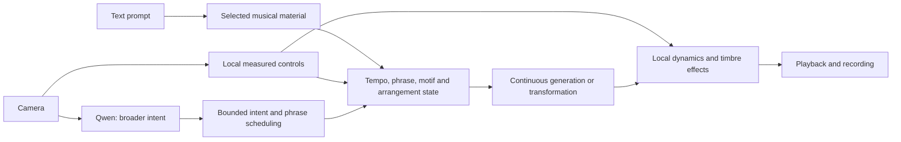

# Sway: a musical flow you can conduct

Date: 2026-09-27, Asia/Singapore.
Status: historical Flow proposal following the working Colab music and Qwen interpretation trial.
The body preserves the proposal as written before the Flow implementation; it does not describe the current control contract.

Later update on September 27: development returned to [Gesture ensemble](gesture-ensemble.md), with Qwen responsible for arranging simultaneous parts from visual inspiration and a shared musical pulse.
The Flow recommendation below is retained as an earlier proposal, not the current priority or definition of the instrument.
Development is now paused; [project status](project-status.md) is the authoritative handoff.

## Recommendation

Choose the interactive music flow direction as the main product, with a small, learnable gesture vocabulary as its control system.
The promise is: **describe a musical world, choose the starting music, then conduct how it unfolds.**

An instrument can contain randomness and still be playable.
The missing property is a reliable relationship between an intentional action and an audible result.
A performer should be able to learn, repeat, anticipate, and recover that relationship.
Sway should establish that relationship at the level of musical texture and arrangement first.

A theremin-like mode remains a coherent alternative, but its central contract would be different: hand position controls pitch and amplitude with immediate feedback.
That would favor a local synthesizer for the directly performed voice, with generated accompaniment as an optional layer.
The present cloud audio path has not demonstrated that level of responsiveness.

## What the current pipeline explains

The generator already preserves state across 40 ms frames in both the [local adapter](../src/sway/music.py) and [Colab adapter](../src/sway/music_jax.py).
An action change updates a blended style target without starting a separate song request.
Consequently, perceived fragmentation is not evidence that the implementation generates independent clips.
It can still arise from changing musical identity, weak phrase memory, or playback gaps; these causes need listening and timing evidence to separate.

Several current behaviors work against the proposed experience:

- The style target heavily weights the current action prompt, so a piano/strum/strike classification can change the sound world.
- The note planner supplies a repeating C / Am / F / G framework, without an explicit motif, section plan, or arrangement history.
- Tracking loss fades the entire output after a grace period, conflating leaving the control area with ending the music.
- Motion energy mainly changes output gain, while register and accents supply note conditioning.
- The output is one stereo mix; the application cannot independently guarantee the behavior of bass, drums, harmony, and melody.

These are code findings from [music.py](../src/sway/music.py), [controller.py](../src/sway/controller.py), and [workers.py](../src/sway/workers.py).
The [live validation](cloud-live-validation-2026-09-27.md) measured a sampled median of 309.2 ms from sending a control to receiving associated audio, excluding camera processing, Qwen, playback buffering, and physical output.
That number also does not measure when the requested musical change becomes audible.

## The first experience

1. Enter a prompt such as “92 BPM, warm electric piano, rounded bass, light broken drums, intimate and restrained.”
2. Audition and select a short starting passage, provisionally 8 or 16 bars once its beat grid is established.
3. Perform three transformations while retaining the passage's musical identity.
4. Return to the original material, or request an intentional ending.
5. Save the audio and the performance controls for later editing.

The anchor must include actual musical material, not only the prompt that produced it.
Save the source audio and its timing information; later, save the symbolic arrangement as well.
Reusing a prompt does not guarantee recovering the same motif.
Tempo, key, groove, and instrument roles should remain stable unless the performer explicitly requests a change.
Prompted tempo and key must be checked against the rendered audio, with a manual correction path.

Proposed initial mappings:

| Input                         | Audible contract                                                                | Timing                                                       |
| ----------------------------- | ------------------------------------------------------------------------------- | ------------------------------------------------------------ |
| Right-hand height             | Raise or lower intensity through a bounded dynamics/brightness macro.           | Smooth local audio response.                                 |
| Left-hand openness            | Make the arrangement sparser or fuller while preserving its pulse and identity. | Apply at the next suitable beat or bar.                      |
| Left-hand horizontal position | Move between the chosen base and one prepared variation.                        | Continuous controlled morph, with an explicit base endpoint. |

These are hypotheses to test with a performer, not validated mappings.
Show each controlled value and any queued change, provide calibration and manual sliders, and allow a comfortable neutral position.
Resting hands or losing tracking should hold the musical state with a short control-release ramp.
An explicit stop or ending command should own silence.
Keep return-to-base and ending as visible buttons until the core mappings are reliable enough to justify gesture triggers.

## Two timescales of change

Visual input should affect both generation and playback, with different responsibilities.
Before generation, the controller requests bounded changes to musical content, such as variation, event density, or a phrase transition.
After generation, local gain and filtering provide immediate expression while the slower content change arrives.
Gain alone is insufficient for the product promise.

Qwen should propose occasional phrase-level intent and help interpret the initial musical brief.
It should not determine continuous hand coordinates or repeatedly replace the piece's identity with a newly inferred instrument label.
Ordinary performance must continue when Qwen is slow or unavailable.

The adapter must expose actual engine capabilities.
Density, isolated parts, exact tempo, and motif preservation must not become UI promises merely because a text prompt can request them.
If the chosen engine cannot meet a contract, use a structured arrangement renderer for that dimension or narrow the control's meaning.

## What to take from DEMON

Inspected the upstream README and selected source at revision `229af3d3d68e7e40764c93259e88149ef6546077`.
The initial assessment was a source review.
The subsequent [Colab feasibility trial](demon-colab-validation-2026-09-27.md) produced listening samples and measured headless transformation throughput; a live camera integration and musical-quality evaluation remain untested.

DEMON documents an ACE-Step streaming transformation engine with prompt blending, reference conditioning, and live parameter automation.
Its published RTX 5090 results are not measurements of our Mac-to-Colab performance path.
Its combined distribution is labeled AGPL-3.0-or-later, which is a product integration consideration if we adopt its code. [Upstream overview](https://github.com/daydreamlive/DEMON/tree/229af3d3d68e7e40764c93259e88149ef6546077)

The particularly relevant mechanism is a persistent source canvas.
The inspected `write_audio` method can replace or overdub a region, including repeated material, without restarting playback; it updates the corresponding source latents with context.
This is a useful architectural reference for preserving a musical anchor while changing it. [Streaming session](https://github.com/daydreamlive/DEMON/blob/229af3d3d68e7e40764c93259e88149ef6546077/acestep/streaming/session.py#L2487)

MIDI means several separate things here:

| Capability                      | Evidence and implication                                                                                                                                                                                                                                                                                                                                            |
| ------------------------------- | ------------------------------------------------------------------------------------------------------------------------------------------------------------------------------------------------------------------------------------------------------------------------------------------------------------------------------------------------------------------- |
| MIDI as a controller            | DEMON's browser routes CC, pitch bend, and note-triggered actions to controls; this is a useful model for giving camera gestures and hardware controls the same parameters. [MIDI hook](https://github.com/daydreamlive/DEMON/blob/229af3d3d68e7e40764c93259e88149ef6546077/demos/realtime_motion_graph_web/web/hooks/useMidi.ts#L330)                              |
| Audio converted to MIDI         | Its optional MuScriptor path transcribes a supplied audio clip on demand; availability depends on optional dependencies and model access. This is inferred note data, not the original generative score. [Transcription implementation](https://github.com/daydreamlive/DEMON/blob/229af3d3d68e7e40764c93259e88149ef6546077/acestep/analysis/midi_transcribe.py#L1) |
| MIDI as an editable composition | Sway would need its own explicit notes, durations, harmony, instrument roles, sections, and automation to promise faithful editing and replay. The two capabilities above do not establish that arrangement model.                                                                                                                                                  |

The next engine comparison should therefore include DEMON's source-preserving transformation path against Sway's current MRT2 flow.
Judge retained identity, audible control, responsiveness, and stability using the same material and gestures.
A source canvas makes continuity a plausible design route; it does not establish perceptual continuity without listening tests.
The current MRT2 adapter does not accept a saved audio passage as a source to transform.
Its baseline can retain a fixed prompt and note framework, but exact return-to-base needs stored-audio playback or another explicit mechanism.
Use a captured MRT2 passage as DEMON's source for the comparison, and account for the different control models rather than treating the engines as interchangeable.

## A path to composition

First record named control curves against a shared beat/bar timeline, independent of whether input comes from the camera, a slider, or MIDI hardware.
Store base material and revisions so a performance can be revisited.
Recording controls enables editing, but exact replay also requires captured audio or a suitably deterministic renderer.

Then introduce a structured score with drums, bass, harmony, melody, motif identifiers, and sections.
An arrangement layer decides which events happen; an audio renderer realizes them.
MIDI can then be imported, edited, and exported from that score instead of attempting to reconstruct every decision from a mixed waveform.
Expressive audio generation can supply texture and variation around the parts whose timing and notes need to be exact.

## First milestone and decision boundary

The next milestone should be one coherent three-minute performance with one chosen musical anchor, three understandable transformations, return-to-base, and an intentional ending.

- A performer can explain each mapping and deliberately repeat its effect across several trials.
- A neutral pose and a temporary tracking loss preserve the music rather than changing its identity or fading it out.
- Changes to musical structure arrive at the advertised boundary; the UI shows what is pending.
- The original material remains recognizable through the allowed variation range, and return-to-base recovers the stored passage.
- Playback passes the existing 20-minute stability gate, and measured gesture-to-audible-response includes buffering and output.

The most informative next technical experiment is a small, bounded comparison of MRT2 continuation with a stable musical identity and DEMON source transformation.
It should precede a large engine migration or an arrangement editor.
The proposed product direction is ready for discussion; no running performance code was changed for this proposal.
