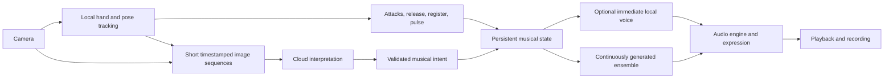

# Sway: model choices and the next product milestone

Researched: 2026-09-26.
Repository baseline: `8357531`, on an M2 Pro with 16 GB of unified memory.
Status: historical research recommendations with a subsequent implementation pilot documented in [cloud validation](cloud-validation-2026-09-26.md).
The pilot added Qwen cloud interpretation and measured MRT2 Base on Colab; the broader product and recognition comparisons below remain proposed work.
Model facts, prices, baseline code descriptions, and recommendations below reflect the September 26 investigation.
The [project handoff](project-status.md) records the later ensemble direction, the decision to retain Qwen, and the project pause.

## September 26 recommendation

Use **Qwen3.8-Max without thinking as the first cloud interpreter**.
Keep **MRT2 Small as the working music baseline**, compare **MRT2 Base** for sound quality, and test **Lyria RealTime** as the cloud music challenger.
Use **Colab for bounded experiments and renders**.
The live instrument should remain playable when a cloud interpretation is late or unavailable.

This selects a practical starting point, not an unmeasured accuracy winner.
Qwen has a documented image/video interface, a non-thinking mode, and a direct path from Sway's existing ordered-image input.
MiMo is the main alternative to challenge that choice; Kimi, GLM, and DeepSeek have relevant visual models and should not be dismissed on the basis of older text-only releases.
The [evaluation plan](evaluation-plan.md) defines how a challenger earns promotion.

The next product milestone is a **three-minute performance with clear musical agency, continuity, and an intentional ending**.
The performer should hear a repeatable relationship between a movement and the resulting music.
A correct action label, a larger model, or an attractive autonomous soundtrack is insufficient on its own.

## What currently limits the experience

These baseline findings come from the code and recorded validation inspected before the cloud pilot.

| Finding                                            | Evidence                                                                                                                                                        | Product implication                                                                             |
| -------------------------------------------------- | --------------------------------------------------------------------------------------------------------------------------------------------------------------- | ----------------------------------------------------------------------------------------------- |
| Timing and action recognition are different paths. | [Gesture mapping](../src/sway/gestures.py) uses recent trajectories; [the controller](../src/sway/controller.py) waits 0.75 seconds for a stable mapped action. | Keep individual attacks independent of deciding which instrument the performer is suggesting.   |
| The small VLM has limited authority.               | AI needs two matching supported results, and a mapped gesture refreshed within two seconds takes priority.                                                      | Replacing the model alone may barely change what reaches the music.                             |
| Visual context is sparse.                          | [Browser capture](../web/app.js) sends three images spanning about one second, at a 3.5-second request interval.                                                | A more capable model still cannot recover movement that was never sampled.                      |
| The audio path adds substantial delay.             | [Playback buffering](../web/audio-buffer.js) starts with 320 ms of audio.                                                                                       | Model inference time is not the latency the performer experiences.                              |
| Continuous playback is unresolved.                 | [Latest gesture validation](gesture-map.md) reports three gaps in a 2:41 combined run and four in a 2:48 map-only run.                                          | Cloud vision may remove GPU contention, but it is not evidence that all gaps will disappear.    |
| Generation is controllable but approximate.        | [Music adapter](../src/sway/music.py) supplies notes and style; the current adapter has no direct BPM setter.                                                   | A requested tempo or drum gesture is not proof of beat-locked accompaniment or exact drum hits. |
| Composition is rudimentary.                        | The note planner repeats C / Am / F / G, each for 16 beats; style changes blend over multiple frames.                                                           | Better phrasing and memory require a musical controller, not only a better action classifier.   |

The latest controlled renders measured roughly 19-20 ms of generation per 40 ms audio frame.
Those measurements establish useful compute headroom in that test, not camera-to-speaker responsiveness.
The nine Jester development clips were used while adjusting the mapping and are not a held-out recognition benchmark.
An earlier nearly five-minute run with zero reported gaps does not supersede the later failures. [Validation](prototype-validation.md), [later results](gesture-map.md)

## Visual interpretation candidates

The capabilities below are documented by the providers as of the research date.
The initial research did not call paid providers.
The subsequent Qwen pilot verified connectivity and observed request timing, but did not establish a recognition ranking.
Account access, region, model revision, and output-schema behavior must be checked during integration.

| Candidate                  | Verified interface facts                                                                                   | Sway decision                                                                                                                                                                                                                                          |
| -------------------------- | ---------------------------------------------------------------------------------------------------------- | ------------------------------------------------------------------------------------------------------------------------------------------------------------------------------------------------------------------------------------------------------ |
| **Qwen3.8-Max**            | Alibaba lists image/video understanding and supports disabling thinking.                                   | First implementation and quality reference; require timely valid output before making it the live default. [Catalog](https://www.alibabacloud.com/help/en/model-studio/models), [vision API](https://www.alibabacloud.com/help/en/model-studio/vision) |
| **MiMo V2.6 Flash / Pro**  | Xiaomi's model cards describe native image, video, audio, and text input and API availability.             | Main challenger; verify the actual account's model IDs, reasoning controls, and pricing before implementing its adapter. [Flash](https://huggingface.co/XiaomiMiMo/MiMo-V2.6-Flash-RL), [Pro](https://huggingface.co/XiaomiMiMo/MiMo-V2.6-Pro-RL)      |
| **Kimi K2.6 / K3**         | K2.6 supports vision and disabled thinking; K3 supports vision but always reasons, with adjustable effort. | Test K2.6 without thinking for live use; K3 at low effort is an additional quality reference if available. [K2.6](https://platform.kimi.ai/docs/guide/kimi-k2-6-quickstart), [K3](https://platform.kimi.ai/docs/guide/kimi-k3-quickstart)              |
| **GLM-5.3-Flash / FlashX** | Current docs list image/video input, JSON output, and reasoning that cannot be disabled.                   | Relevant challenger; measure complete usable output latency rather than inferring speed from “Flash.” [Model documentation](https://docs.z.ai/guides/vlm/glm-5.3-flash)                                                                                |
| **DeepSeek V4.1 Flash**    | The current `deepseek-flash` endpoint accepts images, including multiple images.                           | Include ordered-image evaluation; native video transport and the account's resolved model version remain to be checked. [Vision guide](https://api-docs.deepseek.com/guides/vision/), [release](https://api-docs.deepseek.com/news/news260910/)        |

Qwen also offers `qwen3.8-omni-flash-realtime` with streaming audiovisual input.
The documented flow requires audio input and recommends one video frame per second.
That is not a straightforward replacement for silent, rapid hand-action analysis, so it is a later experiment rather than the first adapter. [Realtime interface](https://www.alibabacloud.com/help/en/model-studio/realtime)

### First Qwen integration

Send timestamped images and measured motion through the local backend, with a short bounded JSON response.
Start with `qwen3.8-max`, `enable_thinking: false`, and a small output budget sufficient for the schema.
Record the returned model identity; pin a dated version once its availability and behavior are confirmed.
Use separate image content blocks for the existing three-frame input.
Qwen's video frame-list interface requires at least four frames. [Vision API](https://www.alibabacloud.com/help/en/model-studio/vision)

Alibaba documents workspace-specific endpoints, including Singapore:

```text
https://{WorkspaceId}.ap-southeast-1.maas.aliyuncs.com/compatible-mode/v1
```

The API key, any supplied workspace, and endpoint must refer to the same region.
Existing regional DashScope endpoints remain supported; the Beijing pilot successfully used `https://dashscope.aliyuncs.com/compatible-mode/v1` without a workspace ID. [Regional endpoints](https://www.alibabacloud.com/help/en/model-studio/regions)
`DASHSCOPE_API_KEY` belongs in the backend environment or a local secret store, never in browser code, committed configuration, or request logs.
The [cloud setup guide](cloud-setup.md) describes the implemented settings and private credential file.
Cloud interpretation sends selected camera images off the Mac; the added mode identifies Qwen and displays that data flow beside the camera control.

Alibaba currently lists Singapore international Qwen3.8-Max at $2 per million input tokens and $6 per million output tokens.
At one request every two seconds, an illustrative 2,000 input and 100 output tokens per request would cost about $0.138 per minute, or $8.28 per hour, before any discounts.
That token count is an assumption, not a measurement of Sway images; log actual usage before estimating session cost. [Pricing](https://www.alibabacloud.com/help/en/model-studio/model-pricing)

## Music engines

The relevant distinction is whether new controls can affect an ongoing performance.
Receiving audio bytes progressively from a fixed song request does not establish that capability.

| Engine                         | Documented control model                                                                               | Recommended role                                                                                                                                                                                      |
| ------------------------------ | ------------------------------------------------------------------------------------------------------ | ----------------------------------------------------------------------------------------------------------------------------------------------------------------------------------------------------- |
| **MRT2 Small, 230M**           | Continuous audio with frame-aligned note and style conditioning.                                       | Current playable baseline and control experiments. [Technical description](https://magenta.withgoogle.com/magenta-realtime-2)                                                                         |
| **MRT2 Base, 2.4B**            | Same model family and live-control design; upstream describes higher quality.                          | First larger-model sound comparison; do not assume real-time operation on this Mac. [Hardware table](https://github.com/magenta/magenta-realtime/blob/main/docs/models.md)                            |
| **Lyria RealTime**             | Bidirectional streaming with weighted prompts and arrangement controls.                                | Cloud ensemble-quality challenger, particularly for broad conducting gestures. [API](https://ai.google.dev/gemini-api/docs/realtime-music-generation)                                                 |
| **Eleven Music**               | The streaming endpoint starts a composition from a prompt or composition plan.                         | Candidate for finished takes and offline arrangements; the inspected interface does not establish mid-performance steering. [Streaming API](https://elevenlabs.io/docs/api-reference/music/stream)    |
| **ACE-Step 1.5, including XL** | Finite generation and editing workflows.                                                               | Offline render/refinement candidate; fast generation alone does not prove a continuously steerable engine. [Inference guide](https://github.com/ace-step/ACE-Step-1.5/blob/main/docs/en/INFERENCE.md) |
| **Stable Audio Open Small**    | Text-to-audio clips up to 11 seconds; the model card describes stronger results on effects than music. | Possible texture source, with lower priority for the core instrument. [Model card](https://huggingface.co/stabilityai/stable-audio-open-small)                                                        |

MRT2's authors report approximately 200 ms of empirical control latency despite 40 ms frames.
This is a vendor measurement, not a measurement of Sway.
They also describe limitations on controlling individual drum hits.
Increasing model size does not remove those constraints. [Technical description](https://magenta.withgoogle.com/magenta-realtime-2)

The upstream hardware table marks MRT2 Base as unsuitable for real-time streaming on M2 Pro, while Small is supported.
Compare Base in offline renders on suitable GPU hardware before selecting production hardware. [Hardware table](https://github.com/magenta/magenta-realtime/blob/main/docs/models.md)

Lyria's `models/lyria-realtime-exp` supports prompt updates and controls such as density, brightness, tempo, scale, and drum/bass muting.
Changing tempo or scale requires a context reset with a hard transition; configuration updates must resend the complete desired configuration.
The inspected controls do not expose note-on scheduling.
These constraints favor arrangement-level use over direct finger performance. [Lyria RealTime API](https://ai.google.dev/gemini-api/docs/realtime-music-generation)
Lyria RealTime account access, quotas, and current charges remain unverified.
Do not apply the separate Lyria fixed-song API's price to this experimental service.

## Proposed instrument architecture

This is the next design to test, not a description of the current implementation.



### 1. Let the performer control attacks immediately

Keep motion onset, release, register, and pulse estimation local.
Do not wait for cloud interpretation to sound an individual event.
Use body-relative coordinates where they improve robustness to camera placement, and allow a brief calibration for the performer's comfortable range.
Distinguish intentional rest, ending, tracking loss, and camera-off behavior.

Measure the existing browser path first, including queue age and generation stalls.
Benchmark upstream's C++ engine with native audio output as the alternative if the current path cannot meet the latency and stability targets.
Upstream already provides an embeddable inference engine; a rewrite should be justified by measured results. [Developer guide](https://github.com/magenta/magenta-realtime/blob/main/docs/apps/developer.md)

If the generative engine cannot make attacks feel immediate, test a small local synthesizer or instrument voice for the performed part, with generated accompaniment around it.
This would be a deliberate new architecture: the current prototype has no synthesizer overlay.
Compare it against the all-generated baseline before adopting it.
Reserve distinct musical roles and registers, and reduce or disable generated percussion when it fights the performed pulse.
Reject the hybrid if it produces doubled attacks, delayed echoes, or an accompaniment that drifts from the performer.
An immediate lead cannot conceal an unresponsive ensemble.

### 2. Give cloud interpretation a useful, slower responsibility

Use visual interpretation for action, articulation, and phrase-level intent.
Keep exact note timing and continuous control values with the local motion path.
Initially add only intents that have a clear, testable musical consequence, such as sparse versus flowing phrasing or a sustained versus struck role.
Treat build, hold, and resolve as later vocabulary that needs performer examples and validation.

Replace the current all-or-nothing competition for one action field with field-specific authority.
Local evidence owns timing; validated semantics can select instrumentation and phrase behavior at safe musical boundaries.
A high-confidence text assertion must not override contradictory tracking evidence.
Retain manual selection and abstention, and show the applied interpretation rather than merely the latest model guess.

Allow one inference in flight and retain only the newest pending observation.
Attach capture interval, request ID, session ID, and expiry to results.
Reject obsolete results after action changes, session restarts, or excessive age.
Never retry old clips into an expanding queue, and never stop the audio callback while waiting for inference.
Check model schema support explicitly and validate every returned field locally.

### 3. Make Sway remember a musical idea

Expand persistent state to include pulse and phase, active motif, harmonic position, instrument roles, phrase length, tension, and ending state.
Let repetition establish a motif; let a change in gesture transform or answer it.
Use hand height for an audible pitch/register relationship and movement quality for articulation or density.
Keep those relationships consistent within a performance.
A neutral rest should create space, while a deliberate finish should produce a cadence and release.

These changes influence notes, style, and arrangement before generation.
Post-generation expression such as gain and filtering can remain useful, but must not be the only audible evidence of control.
Each engine adapter must declare the controls it actually supports.
For example, Lyria's tempo-reset behavior must not be hidden behind an interface that promises seamless tempo following.

### 4. Make the experience dependable

Start with one expressive ensemble and a small vocabulary that a new performer can learn quickly.
Make the connection between movement and sound visible through a short interactive introduction.
Keep experimental model settings out of the performance surface.
Preserve recording, provide a deliberate finish, and surface a clear degraded state when cloud interpretation is unavailable.
Use the [evaluation gates](evaluation-plan.md) to decide when more palettes and gestures are justified.

## Colab and deployment

Colab is useful for larger-model renders, replaying recorded controls, and comparing sound quality without competing with the Mac's audio workload.
Use the project's supported NVIDIA/JAX inference path for MRT2 GPU experiments; the existing MLX export is not a CUDA deployment artifact. [Upstream inference](https://github.com/magenta/magenta-realtime/blob/main/docs/inference.md)
Check the assigned GPU, memory, and actual frame-time distribution instead of assuming a particular GPU will be supplied.

I do not recommend managed Colab as the product's always-on audio backend.
Google documents variable resource availability, idle termination, maximum runtime limits, and restrictions on unrelated web-service hosting. [Colab FAQ](https://research.google.com/colaboratory/faq.html)
If cloud music wins the listening and control tests, deploy it on provisioned compute or a supported live API and measure the full network/audio path.
The initial research started no jobs.
The subsequent [Colab pilot](cloud-validation-2026-09-26.md) measured MRT2 Base at 0.47 times playback speed on L4 and 1.12 times playback speed on A100, with all trial VMs released.
Live Colab-to-browser audio transport was subsequently added and checked in the [September 27 live trial](cloud-live-validation-2026-09-27.md); it remains an experimental performance mode.

## Implementation order

1. Instrument capture-to-sound timing and reproduce playback gaps under controlled load.
2. Compare the implemented Qwen cloud adapter with map-only and local Qwen using the same input and controller.
3. Revise semantic authority separately, so improvements can be attributed to the model or the controller.
4. Compare all-generated performance with the immediate local-voice experiment and test phrase memory.
5. Blind-test MRT2 Small against Base, then compare Lyria on the subset of musical controls it supports.
6. Promote a combination only after a repeatable three-minute performance and the sustained-playback gate pass.

The Qwen pilot now has a working Beijing API key stored outside the repository; a workspace ID is optional when using the supported regional endpoint.
MiMo is the next comparison credential if Qwen misses the recognition or latency targets.
Lyria requires separate Google access if it reaches the music comparison stage.
The deciding evidence is a better playable instrument, not the number of APIs integrated.
